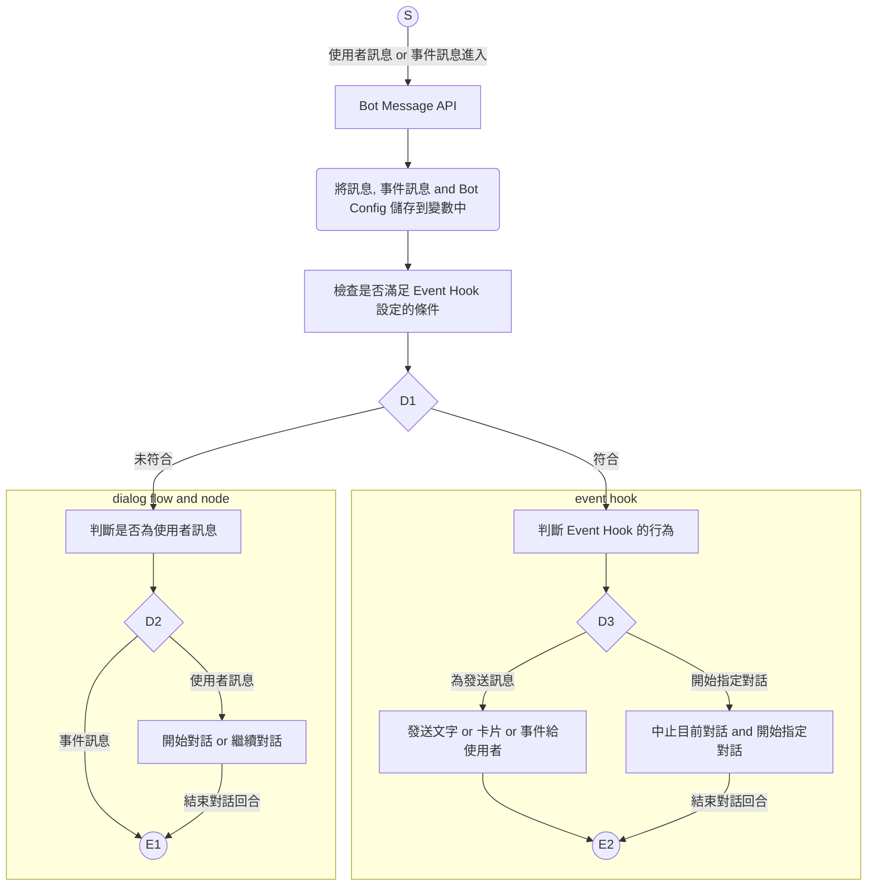

# Bot

## ◆ Bot

Bot 主結構

| 屬性     | 資料型態                            | 必要屬性 | 描述      | 版本 |
| -------------- | ----------------------------------- | -------- | ------------------ | ------------------ |
| Id             | string                              | Y        | Bot 的 ID `(唯一)` | 1.0 |
| Version        | string                              | Y        | Bot Script 版本<br />**● 在1.16版正式使用，詳細請看 `備註1`** | 1.0        |
| SchemaVersion | string | Y | Bot Schema 版本 | 1.14 |
| [Configs](#-configs) | Dictionary<string, object> | N        | Bot 預設變數 (唯讀) | 1.0  |
| BotSettings | List<[IBotSettings](BotSettings.md)> | N | Bot 內部系統設定 | 1.14 |
| [StartFlowId](#-bot-dialog-flows) | string                              | Y        | 入口的流程 ID      | 1.0   |
| [Flows](#-bot-dialog-flows) | [DialogFlow[]](Flows/DialogFlow.md) | Y        | 所有流程           | 1.0        |
| [Events](#-bot-event-hook) | [BaseMessageEvent[]](Events/BaseMessageEvent.md) | N | 全域事件處理 | 1.0 |

* **`備註1`** ：Bot Bot Script 版本會在 User 與 Bot 對話時存到 Bot State，並在每次 User 與 Bot 對話時檢查版本是否一致
    * **請注意當 Bot Script 版本不一致時會強制重置對話**
    * **請注意由 1.15以下的版本升到 1.16 以上的版本時將會強制重置所有的對話**


### ■ Bot Lifecycle




## ◆ Configs

* 其設定值會自動存入[預設變數](Variables/Variable.md#-預設變數)中
* 變數命名限制
  * 只接受**英文字母 (含大小寫)**、**數字**、**底線**等字元，不接受**全形字元**和**空白字元**


## ◆ Bot Settings

* Bot 系統設定，無法被對話流程使用
    * 用於設定 Bot 執行時相關的設定
        * 例如：Adaptive Card Render 方式...
* **[詳細請參考 Bot Settings](BotSettings.md)**


## ◆ Bot Dialog Flows

* [詳細請參考 Bot Dialog Flow](Flows/DialogFlow.md)


## ◆ Bot Event Hook

* [詳細請參考 Bot Event Hook](Events/BaseEvent.md)

>註1：**只要有1個 Bot Event Hook 設定的條件成立時，將不會繼續原本的對話 (Dialog Flow)**

>註2：**如果 Bot Event Hook 的行為設定為切換指定對話  (Dialog Flow)，原本的對話  (Dialog Flow) 將會被強制結束**

>註3：**如果同時有多個 Bot Event Hook 成立時，主會執行優先權最高的 1個 Bot Event Hook**
>
>* **Bot Event Hook 執行優先權：**
>   1. **IsEnable 必需啟用**
>   2. **Bot Event Condition 需要成立** `(計畫中)`
>   3. **Bot Event Hook 條件成立者**
>   4. **Bot Event Hook 的 Priority 最高者**
>   5. **Bot Event Hook Event Array 最前面者**


## ◆ Example


```json
{
    "Id": "DemoBot",
    "Version": "0.1",
    "Profile": {},
    "Configs": {
        "GssBotAppAccessToken": "",
        "LuisConfig": {
            "ApplicationId": "",
            "SubscriptionKey": ""
        }
    },
    "BotSettings": {
        "AdaptiveCardOptions": {
            "SchemaVersion": "1.3",
            "HotfixVersion": "2021.02",
            
            "ChannelOptions": {
                "Emulator": {
                    "SchemaVersion": "1.2",
                    "HotfixVersion": ""
                },
                "WebChat": {
                    "SchemaVersion": "1.3",
                    "HotfixVersion": "2021.02"
                },
                "Iota": {
                    "SchemaVersion": "1.2",
                    "HotfixVersion": "2021.02"
                },
                "Teams": {
                    "SchemaVersion": "1.1",
                    "HotfixVersion": ""
                }
            }
        }
    },
    "StartFlowId": "flow_00001",
    "Flows": []
}
```

