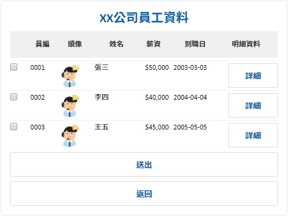

# Adaptive Grid Card Content

> 制式的Adaptive Card 訊息，表格卡片


##  ◆ Screenshot  




## ◆ Channel Support

> [Adaptive Card 文件](https://adaptivecards.io/explorer/)

| Channel 類型            | 是否支援 | 備註                                                         |
| ----------------------- | -------- | ------------------------------------------------------------ |
| Emulator                | **O**    | Adaptive Card 支援的版本為 **1.3**                           |
| Web Chat、iota Chat Bot | **O**    | Adaptive Card 支援的版本為 **1.4**                           |
| iota                    | **O**    | Adaptive Card 支援的版本為 **1.5**                           |
| LINE                    | **O**    | 實作上會的轉成 LINE Flex Message                             |
| Teams                   | **O**    | 1. Adaptive Card 支援的版本為 **1.1**<br />2. 不支援 Audio 和 Video 等元件 |
| Slack                   | **X**    |                                                              |
| Webex                   | **O**    | Adaptive Card 支援的版本為 **1.3**                           |
| Facebook Messenger      | **X**    |                                                              |
| WhatsApp                | **X**    |                                                              |
| Telegram                | **X**    |                                                              |
| M+                      | **X**    |                                                              |
| WeChat(微信個人號)      | **X**    |                                                              |
| WeCom (企業微信)        | **X**    |                                                              |
| DingTalk                | **X**    |                                                              |
| Apple Business Chat     | **X**    |                                                              |


## ◆ Schema

繼承自 [MessageContent](../MessageContent.md)

| 屬性                              | 資料型態                                                     | 必要屬性 | 描述                                                         | 支援變數 | 版本  |
| --------------------------------- | ------------------------------------------------------------ | -------- | ------------------------------------------------------------ | -------- | ----- |
| *Type*                            | string                                                       | Y        | 類型，值為 `adaptive.card.grid`                              | **X**    | 1.1   |
| **Title**                         | string                                                       | N        | 標題                                                         | **O**    | 1.1   |
| **Columns**                       | [AdaptiveGridColumn[]](#-adaptive-grid-column)               | Y        | 資料欄定義                                                   | **X**    | 1.1   |
| **Row**                           | [AdaptiveGridRow](#-adaptive-grid-row)                       | N        | 資料列定義                                                   | **X**    | 1.1   |
| [**Style**](#-grid-style-options) | <string, string>                                             | N        | UI 樣式 (表格)                                               | **X**    | 1.1   |
| **Buttons**                       | [AdaptiveButtonContent[]](ActionContent.md#adaptive-action-content) | N        | Adaptive Card 按鈕                                           | **X**    | 1.1   |
| **DataSource**                    | string                                                       | Y        | 指定資料來源 (自訂變數)，**僅用於 Grid Item**，**`必須指定`** | **O**    | 1.1   |
| **EmptyDataText**                 | string                                                       | N        | 未指定資料來源、資料為空時的提示訊息，有預設的提示訊息       | **O**    | 1.1   |
| **Locale**                        | string                                                       | N        | 地區，用於處理文字格式化，預設值為伺服器所使用的地區         | **X**    | 1.1   |
| *QuickReply*                      | [ButtonContent[]](Components/ButtonContent.md)               | N        | 快速回覆按鈕                                                 | **X**    | 1.1   |
| *ChannelDataPayload*              | object                                                       | N        | Channel Data Payload，[使用限制](../Components/ChannelDataPayload.md) | **O**    | 1.14  |
| *Options*                         | [MessageContentOption](../AdaptiveCardContent.md#-message-content-option) | `[1]`    | 訊息相關參數，僅限 [Bot 通知訊息服務 (ETA)](https://git.gss.com.tw/fpsbu/bot_event_trigger_service) 發送通知訊息使用 | **X**    | **X** |

* **Locale**
    * [Locale Code](http://www.codedigest.com/CodeDigest/207-Get-All-Language-Country-Code-List-for-all-Culture-in-C---ASP-Net.aspx)
* `[1]` 這個參數僅限 [Bot 通知訊息服務 (ETA)](https://git.gss.com.tw/fpsbu/bot_event_trigger_service) 發送通知訊息使用
    * 這個參數不適用 Bot Flow Engine 主程式，Bot Flow Engine 主程式只在 [appsettings.json 設定


### ■ Adaptive Grid Column

| 資料類型   | 欄位類型                             | 描述     | 版本 |
| ---------- | ------------------------------------ | -------- | ---- |
| `string`   | [Text Column](#-text-column)         | 字串     | 1.1  |
| `integer`  | [Text Column](#-text-column)         | 整數     | 1.1  |
| `float`    | [Text Column](#-text-column)         | 浮點數   | 1.1  |
| `date`     | [Text Column](#-text-column)         | 日期時間 | 1.1  |
| `image`    | [Image Column](#-image-column)       | 圖片     | 1.1  |
| `button`   | [Button Column](#-button-column)     | 按鈕     | 1.1  |
| `checkbox` | [CheckBox Column](#-checkbox-column) | 勾選框   | 1.1  |

#### ● Text Column

| 屬性                            | 資料型態         | 必要屬性 | 描述                     | 支援變數 | 指定 DataSource | 版本 |
| ------------------------------- | ---------------- | -------- | ------------------------ | -------- | --------------- | ---- |
| Id                              | string           | Y        | 欄位索引，**`不得重複`** | **X**    | **X**           | 1.1  |
| Title                           | string           | Y        | 標題                     | **O**    | **X**           | 1.1  |
| ContentType                     | string           | Y        | 資料類型，預設值：`text` | **X**    | **X**           | 1.1  |
| Value                           | string           | Y        | 資料                     | **X**    | **O**           | 1.1  |
| [Style](#-column-style-options) | <string, string> | N        | UI 樣式 (欄)             | **X**    | **X**           | 1.1  |

#### ● Image Column

* 如果要設定 Image Tap，請清除 Row Tap 的設定

| 屬性                            | 資料型態                                                     | 必要屬性 | 描述                     | 支援變數 | 指定 DataSource | 版本 |
| ------------------------------- | ------------------------------------------------------------ | -------- | ------------------------ | -------- | --------------- | ---- |
| Id                              | string                                                       | Y        | 欄位索引，**`不得重複`** | **X**    | **X**           | 1.1  |
| Title                           | string                                                       | Y        | 標題                     | **O**    | **X**           | 1.1  |
| ContentType                     | string                                                       | Y        | 資料類型，值為`image`    | **X**    | **X**           | 1.1  |
| Value                           | string                                                       | Y        | 圖片連結                 | **X**    | **O**           | 1.1  |
| Action                          | [AdaptiveSelectActionContent](ActionContent.md#adaptive-select-action-content) | N        | 點擊事件                 | **X**    | **X**           | 1.1  |
| [Style](#-column-style-options) | <string, string>                                             | N        | UI 樣式 (欄)             | **X**    | **X**           | 1.1  |

#### ● Button Column

* 請清除 Row Tap 的設定，`且 Channel 支援 Adaptive Card 的版本至少需要 1.2 版`

| 屬性                            | 資料型態                                                     | 必要屬性 | 描述                     | 支援變數 | 指定 DataSource  | 版本 |
| ------------------------------- | ------------------------------------------------------------ | -------- | ------------------------ | -------- | ---------------- | ---- |
| Id                              | string                                                       | Y        | 欄位索引，**`不得重複`** | **X**    | **X**            | 1.1  |
| Title                           | string                                                       | Y        | 標題                     | **O**    | **X**            | 1.1  |
| ContentType                     | string                                                       | Y        | 資料類型，值為`button`   | **X**    | **X**            | 1.1  |
| Action                          | [AdaptiveActionContent](ActionContent.md#adaptive-action-content) | N        | 點擊事件                 | **X**    | **O** (標題和值) | 1.1  |
| [Style](#-column-style-options) | <string, string>                                             | N        | UI 樣式 (欄)             | **X**    | **X**            | 1.1  |

#### ● Checkbox Column

* 如果有設定這個欄位，任何的 Card Action、Tap Aciotn、Button Action 的 Value 必須是個物件

| 屬性                            | 資料型態         | 必要屬性 | 描述                               | 支援變數 | 指定 DataSource | 版本 |
| ------------------------------- | ---------------- | -------- | ---------------------------------- | -------- | --------------- | ---- |
| Id                              | string           | Y        | 欄位索引，**`不得重複`**           | **X**    | **X**           | 1.1  |
| Title                           | string           | Y        | 標題                               | **O**    | **X**           | 1.1  |
| ContentType                     | string           | Y        | 資料類型，值為`checkbox`           | **X**    | **X**           | 1.1  |
| Value                           | string           | N        | 資料列識別代號，**`代號不得重複`** | **X**    | **O**           | 1.1  |
| [Style](#-column-style-options) | <string, string> | N        | UI 樣式 (欄)                       | **X**    | **X**           | 1.1  |


### ■ Adaptive Grid Row

> 建議如果有設定 Button Column Action 或 Image Column Tap，請擇一清除設定，以避免不必要的問題

| 屬性 | 資料型態                                                     | 必要屬性 | 描述     | 支援變數 | 指定 DataSource | 版本 |
| ---- | ------------------------------------------------------------ | -------- | -------- | -------- | --------------- | ---- |
| Tap  | [AdaptiveSelectActionContent](ActionContent.md#adaptive-select-action-content) | N        | 點擊事件 | **X**    | **O** (Tap 值)  | 1.1  |


## ◆ Example

### ■ 指定 DataSouce 內容

* **變數名稱** ─ `$.Variables.Company`

```json
"護國神山"
```

* **變數名稱** ─ `$.Variables.Employee`

```json
[
    {
        "Id": "1",
        "Name": "張三",
        "Pay": "50000",
        "StartDate": "2003-03-03"
    },
    {
        "Id": "2",
        "Name": "李四",
        "Pay": "40000",
        "StartDate": "2004-04-04"
    },
    {
        "Id": "3",
        "Name": "王五",
        "Pay": "45000",
        "StartDate": "2005-05-05"
    }
]
```

* **Json (無按鈕)**


```json
{
    "Type": "adaptive.card.grid",
    "Title": "{{$.Variables.Company}}公司員工資料",
    "Columns": [
        {
            "ContentType": "integer",
            "Id": "Id",
            "Title": "員編",
            "Value": "{{$.Id}}",
            "Styles": {
                "Width": "20",
                "TextAlignment": "right",
                "TextFormat": "0000"
            }
        },
        {
            "ContentType": "image",
            "Id": "Avatar",
            "Title": "頭像",
            "Value": "https://xxx.com.tw/HRService/avatar/id/{{$.Id}}",
            "Action": null,
            "Styles": {
                "Width": "40",
                "ImageStyle": "person"
            }
        },
        {
            "ContentType": "string",
            "Id": "Name",
            "Title": "姓名",
            "Value": "{{$.Name}}",
            "Action": null,
            "Styles": {
                "Width": "40",
                "TextAlignment": "left"
            }
        },
        {
            "ContentType": "string",
            "Id": "Pay",
            "Title": "薪資",
            "Value": "{{$.Pay}}",
            "Action": null,
            "Styles": {
                "Width": "30",
                "TextAlignment": "right",
                "TextFormat": "C0"
            }
        },
        {
            "ContentType": "string",
            "Id": "StartDate",
            "Title": "到職日",
            "Value": "{{$.StartDate}}",
            "Styles": {
                "Width": "60",
                "TextAlignment": "left",
                "TextFormat": "yyyy-MM-dd"
            }
        }
    ],
    "Row": {
        "Tap": {
            "Type": "submit.data",
            "Value": "{\"Action\": \"Detial\",\"EmpId\": {{$.Id}}}"
        }
    },
    "Buttons": [
        {
            "Type": "submit.data",
            "Title": "返回",
            "Value": {
                "Action": "Cancel"
            },
            "Style": "destructive"
        }
    ],
    "DataSource": "$.Variables.Employee",
    "Styles": {
        "HeaderBackground": "emphasis",
        "HeaderTextColor": "accent"
    },
    "Locale": ""
}
```

* **Json (有按鈕)**


```json
{
    "Type": "adaptive.card.grid",
    "Title": "{{$.Variables.Company}}公司員工資料",
    "Columns": [
        {
            "ContentType": "checkbox",
            "Id": "CheckId",
            "Title": "",
            "Value": "emp-{{$.Id}}",
            "Styles": {
                "Width": "10"
            }
        },
        {
            "ContentType": "integer",
            "Id": "Id",
            "Title": "員編",
            "Value": "{{$.Id}}",
            "Styles": {
                "Width": "20",
                "TextAlignment": "right",
                "TextFormat": "0000"
            }
        },
        {
            "ContentType": "image",
            "Title": "頭像",
            "Value": "https://xxx.com/HRService/avatar/id/{{$.Id}}",
            "Styles": {
            	"Width": "40",
                "ImageStyle": "person"
            }
        },
        {
            "ContentType": "string",
            "Title": "姓名",
            "Value": "{{$.Name}}",
            "Styles": {
            	"Width": "40",
            	"TextAlignment": "left"
            }
        },
        {
            "ContentType": "string",
            "Title": "薪資",
            "Value": "{{$.Pay}}",
        	"Styles": {
            	"Width": "30",
            	"TextAlignment": "right",
                "TextFormat": "C0"
            }
        },
        {
            "ContentType": "string",
            "Title": "到職日",
            "Value": "{{$.StartDate}}",
        	"Styles": {
            	"Width": "60",
            	"TextAlignment": "left",
                "TextFormat": "yyyy-MM-dd"
            }
        },
        {
            "ContentType": "button",
            "Title": "詳細資訊",
            "Action":{
                "Type": "submit.data",
                "Title": "詳細",
                "Value": "{\"Action\": \"Detial\",\"EmpId\": {{$.Id}}}"
            },
            "Styles": {}
        }
    ],
    "Row": {
        "Tap": null
    },
    "Buttons": [
        {
            "Type": "submit.data",
            "Title": "送出",
            "Value": {
                "Action":  "Send"
            },
            "Style": "positive"
        },
        {
            "Type": "submit.data",
            "Title": "返回",
            "Value": {
                "Action": "Cancel"
            },
            "Style": "destructive"
        }
    ],
    "DataSource": "$.Variables.Employee",
    "Styles": {
        "HeaderBackground": "emphasis",
        "HeaderTextColor": "accent"
    },
    "Locale": ""
}
```


## ◆ Grid Style Options

> 有需要在使用，沒有設定的項目會使用預設值

| 樣式選項             | 說明                                                  | 支援變數 | 參考                                                         |
| -------------------- | ----------------------------------------------------- | -------- | ------------------------------------------------------------ |
| CardTitleColor       | [**卡片**] 標題字型顏色，預設： `Default`             | **X**    | [Text Block - Color](https://adaptivecards.io/explorer/TextBlock.html) |
| CardTitleSize        | [**卡片**] 標題字型大小，預設： `Medium`              | **X**    | [Text Block - Size](https://adaptivecards.io/explorer/TextBlock.html) |
| CardTitleWeight      | [**卡片**] 標題字型粗細，預設： `Bolder`              | **X**    | [Text Block - Weight](https://adaptivecards.io/explorer/TextBlock.html) |
| CardTitleAlignment   | [**卡片**] 標題對齊方式，預設： `Left`                | **X**    | [Text Block - Horizontal Alignment](https://adaptivecards.io/explorer/TextBlock.html) |
| NoDataTextColor      | [**卡片**] 空資料提示文字的字型顏色，預設： `Default` | **X**    | [Text Block - Color](https://adaptivecards.io/explorer/TextBlock.html) |
| NoDataTextSize       | [**卡片**] 空資料提示文字的字型大小，預設： `Medium`  | **X**    | [Text Block - Size](https://adaptivecards.io/explorer/TextBlock.html) |
| NoDataTextBackground | [**卡片**] 空資料提示文字的背景樣式 或 背景圖片       | **O**    | [Container - Style](https://adaptivecards.io/explorer/Container.html) |
| HeaderBackground     | [**Header**] 背景樣式 或 背景圖片，預設值：`emphasis` | **O**    | [Container - Style](https://adaptivecards.io/explorer/Container.html) |
| HeaderTextSize       | [**Header**] 文字大小                                 | **X**    | [Text Block - Size](https://adaptivecards.io/explorer/TextBlock.html) |
| HeaderTextColor      | [**Header**] 文字顏色                                 | **X**    | [Text Block - Color](https://adaptivecards.io/explorer/TextBlock.html) |
| RowBackground        | [**Row**] 背景樣式 或 背景圖片                        | **O**    | [Container - Style](https://adaptivecards.io/explorer/Container.html) |
| RowTextSize          | [**Row**]文字大小                                     | **X**    | [Text Block - Size](https://adaptivecards.io/explorer/TextBlock.html) |
| RowTextColor         | [**Row**]文字顏色                                     | **X**    | [Text Block - Color](https://adaptivecards.io/explorer/TextBlock.html) |


## ◆ Column Style Options

> 有需要在使用，沒有設定的項目會使用預設值


| 樣式選項       | 說明                                  | 支援變數 | 參考                                                         |
| -------------- | ------------------------------------- | -------- | ------------------------------------------------------------ |
| Width          | 寬度 (權重值)，預設值：`50`           | **X**    |                                                              |
| TextAlignment  | 文字對齊方式，預設值： `auto`         | **X**    | ● **auto**：自動<br />● **left**：靠左對齊<br />● **center**：置中<br />● **right**：靠又對齊 |
| TextFormat     | 文字的格式                            | **X**    | 請參考下方 **Text Format**                                   |
| ImageSize      | 圖片大小                              | **X**    | [Image - Size](https://adaptivecards.io/explorer/Image.html) |
| ImageStyle     | 圖片樣式                              | **X**    | [Image - Style](https://adaptivecards.io/explorer/Image.html) |
| ImageAlignment | 圖片對齊方式，預設值： `center`       | **X**    | ● **left**：靠左對齊<br />● **center**：置中<br />● **right**：靠又對齊 |
| IsChecked      | Check Box 是否為勾選，預設值：`false` | **X**    | ● **true**： 勾選<br />● **false**：無勾選                   |

* **Text Format**
    * [標準數值格式字串](https://docs.microsoft.com/zh-tw/dotnet/standard/base-types/standard-numeric-format-strings)
    * [自訂數值格式字串](https://docs.microsoft.com/zh-tw/dotnet/standard/base-types/custom-numeric-format-strings)
    * [標準日期和時間格式字串](https://docs.microsoft.com/zh-tw/dotnet/standard/base-types/standard-date-and-time-format-strings)
    * [自訂日期與時間格式字串](https://docs.microsoft.com/zh-tw/dotnet/standard/base-types/custom-date-and-time-format-strings)
    * [標準 TimeSpan 格式字串](https://docs.microsoft.com/zh-tw/dotnet/standard/base-types/standard-timespan-format-strings)
    * [自訂 TimeSpan 格式字串](https://docs.microsoft.com/zh-tw/dotnet/standard/base-types/custom-timespan-format-strings)