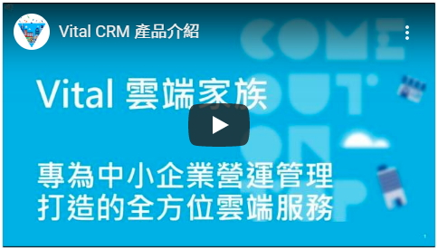

# Attachment Content

> 靜態的附件訊息，可以選擇檔案、圖片、音樂、影片


## ◆ Channel Support

| Channel 類型            | 是否支援 | 備註                                                         |
| ----------------------- | -------- | ------------------------------------------------------------ |
| Emulator                | **O**    |                                                              |
| Web Chat、iota Chat Bot | **O**    |                                                              |
| iota                    | **X**    |                                                              |
| LINE                    | **O**    | 1. 圖片僅限 JPG、PNG，檔案上限 1 MB、需要 HTTPS<br />2. 聲音檔僅限 MP3，檔案上限 10 MB、需要 HTTPS<br />3. 影片檔僅限 MP4，檔案上限 10 MB、需要 HTTPS |
| Teams                   | **O**    | 檔案上限 4MB                                                 |
| Slack                   | **X**    |                                                              |
| Webex                   | **X**    |                                                              |
| Facebook Messenger      | **O**    | 檔案上限 25 MB                                               |
| WhatsApp                | **O**    | 檔案上限 100 MB                                              |
| Telegram                | **O**    | 檔案上限未知                                                 |
| M+                      | **O**    |                                                              |
| WeChat (微信個人號)     | **X**    |                                                              |
| WeCom (企業微信)        | **X**    |                                                              |
| DingTalk                | **X**    |                                                              |
| Apple Business Chat     | **X**    |                                                              |


## ◆ Schema

繼承自 [MessageContent](MessageContent.md)

| 屬性                 | 資料型態                                       | 必要屬性 | 描述                                                         | 支援變數 | 版本 |
| -------------------- | ---------------------------------------------- | -------- | ------------------------------------------------------------ | -------- | ---- |
| *Type*               | string                                         | Y        | 類型，值為 `attachment`                                      | **X**    | 1.1  |
| **FileType**         | string                                         | N        | 附件類型，預設值：`auto`                                     | **X**    | 1.1  |
| **Url**              | string                                         | N        | 附件連結                                                     | **O**    | 1.1  |
| **Name**             | string                                         | N        | 附件檔名                                                     | **O**    | 1.1  |
| *QuickReply*         | [ButtonContent[]](Components/ButtonContent.md) | N        | 快速回覆按鈕                                                 | **X**    | 1.1  |
| *ChannelDataPayload* | object                                         | N        | Channel Data Payload，[使用限制](../Components/ChannelDataPayload.md) | **O**    | 1.14 |

* **File Type**
    * `auto` ─ 依照附件檔名的副檔名自動判斷
    * `image` ─ 圖片顯示
    * `audio` ─ 音樂顯示
    * `video` ─ 影片顯示
    * `youtube` ─ YouTube 影片
    * `file` ─ 檔案下載


## ◆ Example

### ● 圖片


```json
{
    "Type": "attachment",
    "FileType": "image",
    "Url": "https://adaptivecards.io/content/poster-audio.jpg",
    "Name": "poster-audio.jpg",
    "QuickReply": []
}
```

### ● 音樂


```json
{
    "Type": "attachment",
    "FileType": "audio",
    "Url": "https://adaptivecardsblob.blob.core.windows.net/assets/AdaptiveCardsOverviewVideo.mp3",
    "Name": "AdaptiveCardsOverviewVideo.mp3",
    "QuickReply": []
}
```

### ● 影片


```json
{
    "Type": "attachment",
    "FileType": "video",
    "Url": "https://adaptivecardsblob.blob.core.windows.net/assets/AdaptiveCardsOverviewVideo.mp4",
    "Name": "AdaptiveCardsOverviewVideo.mp4",
    "QuickReply": []
}
```

### ● YouTube 影片



```json
{
    "Type": "attachment",
    "FileType": "youtube",
    "Url": "https://www.youtube.com/watch?v=8UsaBBrrL7c",
    "Name": "youtube",
    "QuickReply": []
}
```
### ● 檔案


```json
{
    "Type": "attachment",
    "FileType": "file",
    "Url": "https://github.com/microsoft/botbuilder-dotnet/archive/master.zip",
    "Name": "botbuilder-dotnet-master.zip",
    "QuickReply": []
}
```


