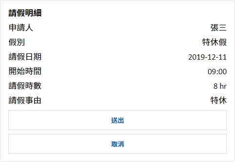
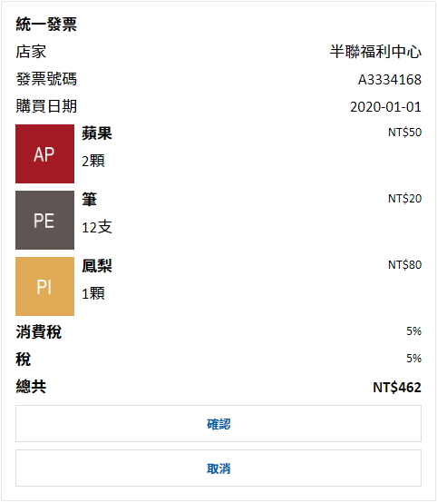

# Receipt Card Content

> 靜態的Receipt Card訊息


## ◆ Channel Support

| Channel 類型            | 是否支援 | 備註                                                         |
| ----------------------- | -------- | ------------------------------------------------------------ |
| Emulator                | **O**    |                                                              |
| Web Chat、iota Chat Bot | **O**    |                                                              |
| iota                    | **O**    | 1. 舊版 iota不支援 Carousel 卡片排版<br />2. 實作上會轉換成 Adaptive Card |
| LINE                    | **O**    | 1. 實作上會轉換成 LINE Flex Message<br />2. ~~卡片 PostBack 按鈕回覆的值是放在 Activity.Text~~<br />3. 圖片只支援 JPG 和 PNG，檔案上限 1 MB，需要 HTTPS |
| Teams                   | **O**    | 卡片按鈕皆視為 ImBack                                        |
| Slack                   | **X**    |                                                              |
| Webex                   | **O**    | 1. 實作上會轉換成 Adaptive Card<br />2. 按鈕數量最多5個      |
| Facebook Messenger      | **X**    |                                                              |
| WhatsApp                | **X**    |                                                              |
| Telegram                | **X**    |                                                              |
| M+                      | **X**    |                                                              |
| WeChat (微信個人號)     | **X**    |                                                              |
| WeCom (企業微信)        | **X**    |                                                              |
| DingTalk                | **X**    |                                                              |
| Apple Business Chat     | **X**    |                                                              |


## ◆ Schema

繼承自 [MessageContent](MessageContent.md)

| 屬性                  | 資料型態                                       | 必要屬性 | 描述                                                         | 支援變數 | 版本 |
| --------------------- | ---------------------------------------------- | -------- | ------------------------------------------------------------ | -------- | ---- |
| *Type*                | string                                         | Y        | 類型，值為 `receipt.card`                                    | **X**    | 1.1  |
| **Title**             | string                                         | N        | 標題                                                         | **O**    | 1.1  |
| **FactItems**         | [Fact[]](#-fact-item)                          | N        | 明細內容                                                     | **O**    | 1.1  |
| **ReceiptItem**       | [ReceiptItem](#receipt-item)                   | N        | 收據清單內容                                                 | **X**    | 1.1  |
| **Tax**               | [NumberContent](#-number-content)              | N        | 收據清單 (含稅內容)                                          | **O**    | 1.1  |
| **Vat**               | [NumberContent](#-number-content)              | N        | 收據清單 (VAT內容)                                           | **O**    | 1.1  |
| **Total**             | [NumberContent](#-number-content)              | N        | 收據清單 (加總內容)                                          | **O**    | 1.1  |
| **FactDataSource**    | string                                         | N        | Fact 項目資料來源 (變數)                                     | **O**    | 1.1  |
| **ReceiptDataSource** | string                                         | N        | Receipt 項目資料來源 (變數)                                  | **O**    | 1.1  |
| **Buttons**           | [ButtonContent[]](Components/ButtonContent.md) | N        | 按鈕                                                         | **X**    | 1.1  |
| **Locale**            | string                                         | N        | 地區，用於處理文字格式化，預設值為伺服器所使用的地區         | **X**    | 1.1  |
| *QuickReply*          | [ButtonContent[]](Components/ButtonContent.md) | N        | 快速回覆按鈕                                                 | **X**    | 1.1  |
| *ChannelDataPayload*  | object                                         | N        | Channel Data Payload，[使用限制](../Components/ChannelDataPayload.md) | **O**    | 1.14 |

### ■ Fact Item

| 屬性       | 資料型態 | 必要屬性 | 描述                                | 支援變數 | 版本 |
| ---------- | -------- | -------- | ----------------------------------- | -------- | ---- |
| Title      | string   | Y        | 標題                                | **O**    | 1.1  |
| Text       | string   | Y        | 文字                                | **O**    | 1.1  |
| TextType   | string   | N        | 文字資料型態，預設：`string`        | **X**    | 1.1  |
| TextFormat | string   | N        | 文字顯示的格式，需指定 TextDataType | **X**    | 1.1  |

* **Text Type**
    * `string` ─ 字串 (預設)
    * `integer` ─ 整數
    * `float` ─ 浮點數
    * `date` ─ 日期時間
    * `timespan` ─ 時間差


### ■ Receipt Item

| 屬性     | 資料型態                                       | 必要屬性 | 描述          | 支援變數 | 版本 |
| -------- | ---------------------------------------------- | -------- | ------------- | -------- | ---- |
| Title    | string                                         | Y        | 標題          | **O**    | 1.1  |
| Subtitle | string                                         | N        | 副標題        | **O**    | 1.1  |
| Text     | string                                         | N        | 文字 `(預留)` | **O**    | 1.1  |
| ImageUrl | string                                         | N        | 圖片          | **O**    | 1.1  |
| Price    | [NumberContent](#-number-content)              | N        | 價錢          | **O**    | 1.1  |
| Quantity | [NumberContent](#-number-content)              | N        | 數量`(預留)`  | **O**    | 1.1  |
| Tap      | [ButtonContent[]](Components/ButtonContent.md) | N        | 點擊事件      | **X**    | 1.1  |

### ■ Number Content

| 屬性        | 資料型態 | 必要屬性 | 描述               | 支援變數 | 版本 |
| ----------- | -------- | -------- | ------------------ | -------- | ---- |
| Value       | double   | Y        | 值 (double string) | **O**    | 1.1  |
| ValueFormat | string   | N        | 格式               | **X**    | 1.1  |


## ◆ Example

### ● 明細項目 (未指定 DataSource)

> 當 DataSource 未設定時，預設使用所有的自動變數與自訂變數





```json
{
    "Type": "receipt.card",
    "Title": "請假明細",
    "FactItems": [
        {
            "Title": "申請人",
            "Text": "{{$.Conversation.UserName}}",
            "TextType": "string",
            "TextFormat": ""
        },
        {
            "Title": "假別",
            "Text": "特休假",
            "TextType": "string",
            "TextFormat": ""
        },
        {
            "Title": "請假日期",
            "Text": "2019-12-11 09:00",
            "TextType": "date",
            "TextFormat": "yyyy-MM-dd"
        },
        {
            "Title": "開始時間",
            "Text": "2019-12-11 09:00",
            "TextType": "date",
            "TextFormat": "HH:mm"
        },
        {
            "Title": "請假時數",
            "Text": "8",
            "TextType": "float",
            "TextFormat": "# hr"
        },
        {
            "Title": "請假事由",
            "Text": "特休",
            "TextType": "string",
            "TextFormat": ""
        }
    ],
    "FactDataSource": "",
    "ReceiptItem": {},
    "ReceiptDataSource": "",
    "Tax": "",
    "Vat": "",
    "Total": "",
    "Buttons": [
        {
            "Type": "imBack",
            "Title": "送出",
            "Value": "Send"
        },
        {
            "Type": "imBack",
            "Title": "取消",
            "Value": "Cancel"
        }
    ],
    "QuickReply": []
}
```


### ● 明細項目 (指定 DataSource)


* **變數名稱** ─ `$.Variables.LeaveInfo`

```json
{
    "Applicant": "張三",
    "LeaveType": "特休假",
    "StartDate": "2019-12-11 09:00",
    "LeaveHours": "8",
    "Subject": "特休"
}
```

* **Json**
    * **`Facts 能夠使用的變數只限 Data Source 指定的內容，因此不支援自動變數與自訂變數`**
    * 若要使用自動變數、自訂變數，請將所需的資料事先匯入到 DataSource

```json
{
    "Type": "receipt.card",
    "Title": "請假明細",
    "FactItems": [
        {
            "Title": "申請人",
            "Text": "{{$.Applicant}}",
            "TextType": "string",
            "TextFormat": ""
        },
        {
            "Title": "假別",
            "Text": "{{$.LeaveType}}",
            "TextType": "string",
            "TextFormat": ""
        },
        {
            "Title": "請假日期",
            "Text": "{{$.StartDate}}",
            "TextType": "date",
            "TextFormat": "yyyy-MM-dd"
        },
        {
            "Title": "開始時間",
            "Text": "{{$.StartDate}}",
            "TextType": "date",
            "TextFormat": "HH:mm"
        },
        {
            "Title": "請假時數",
            "Text": "{{$.LeaveHours}}",
            "TextType": "float",
            "TextFormat": "# hr"
        },
        {
            "Title": "請假事由",
            "Text": "{{$.Subject}}",
            "TextType": "string",
            "TextFormat": ""
        }
    ],
    "FactDataSource": "$.Variables.LeaveInfo",
    "ReceiptItem": {},
    "ReceiptDataSource": "",
    "Tax": "",
    "Vat": "",
    "Total": "",
    "Buttons": [
        {
            "Type": "imBack",
            "Title": "送出",
            "Value": "Send"
        },
        {
            "Type": "imBack",
            "Title": "取消",
            "Value": "Cancel"
        }
    ],
    "QuickReply": []
}
```


### ● 清單項目 (指定 DataSource)


* **變數名稱** ─ `$.Variables.ShoppingCartList`

```json
[
    {
        "ItemName": "蘋果",
        "ItemNum": "2顆",
        "Quantity": "2",
        "Price": "50",
        "Image": "https://via.placeholder.com/150/9D1A20/FFFFFF/?text=AP"
    },
    {
        "ItemName": "筆",
        "ItemNum": "12支",
        "Quantity": "12",
        "Price": "20",
        "Image": "https://via.placeholder.com/150/5E5654/FFFFFF/?text=PE"
    },
    {
        "ItemName": "鳳梨",
        "ItemNum": "1顆",
        "Quantity": "1",
        "Price": "80",
        "Image": "https://via.placeholder.com/150/DDA94C/FFFFFF/?text=PI"
    }
]
```

* **Json**
    * **`Receipt Items 能夠使用的變數只限 Data Source 指定的內容，因此不支援自動變數與自訂變數`**
    * 若要使用自動變數、自訂變數，請將所需的資料事先匯入到 DataSource

```json
{
    "Type": "receipt.card",
    "Title": "購物車",
    "FactItems": [],
    "FactDataSource": "",
    "ReceiptItem": {
        "ImageUrl": "{{$.Image}}",
        "Title": "{{$.ItemName}}",
        "Subtitle": "{{$.ItemNum}}",
        "Text": "{{$.Descriotion}}",
        "Price": {
            "Value": "{{$.Price}}",
            "ValueFormat": "C0"
        },
        "Quantity": {
            "Value": "{{$.Quantity}}",
            "ValueFormat": "N0"
        }
    },
    "ReceiptDataSource": "$.Variables.ShoppingCartList",
    "Tax": {
        "Value": "{{$.Variables.ShoppingCart.Tax}}",
        "ValueFormat": "P0"
    },
    "Vat": {
        "Value": "{{$.Variables.ShoppingCart.Vat}}",
        "ValueFormat": "P0"
    },
    "Total": {
        "Value": "{{$.Variables.ShoppingCart.Total}}",
        "ValueFormat": "C0"
    },
    "Buttons": [
        {
            "Type": "imBack",
            "Title": "確認",
            "Value": "Send"
        },
        {
            "Type": "imBack",
            "Title": "取消",
            "Value": "Cancel"
        }
    ],
    "QuickReply": []
}
```


### ● 明細+清單項目 (指定 DataSource)



* **變數名稱** ─ `$.Variables.ShoppingCartList`

```json
[
    {
        "ItemName": "蘋果",
        "ItemNum": "2顆",
        "Quantity": "2",
        "Price": "50",
        "Image": "https://via.placeholder.com/150/9D1A20/FFFFFF/?text=AP"
    },
    {
        "ItemName": "筆",
        "ItemNum": "12支",
        "Quantity": "12",
        "Price": "20",
        "Image": "https://via.placeholder.com/150/5E5654/FFFFFF/?text=PE"
    },
    {
        "ItemName": "鳳梨",
        "ItemNum": "1顆",
        "Quantity": "1",
        "Price": "80",
        "Image": "https://via.placeholder.com/150/DDA94C/FFFFFF/?text=PI"
    }
]
```

* **Json**
    * **`Receipt Items 能夠使用的變數只限 Data Source 指定的內容，因此不支援自動變數與自訂變數`**
    * 若要使用自動變數、自訂變數，請將所需的資料事先匯入到 DataSource

```json
{
    "Type": "receipt.card",
    "Title": "統一發票",
    "FactItems": [
        {
            "Title": "店家",
            "Text": "{{$.Store}}",
            "TextType": "string",
            "TextFormat": ""
        },
        {
            "Title": "發票號碼",
            "Text": "{{$.TaxId}}",
            "TextType": "string",
            "TextFormat": ""
        },
        {
            "Title": "購買日期",
            "Text": "{{$.Date}}",
            "TextType": "date",
            "TextFormat": "yyyy-MM-dd"
        }
    ],
    "FactDataSource": "$.Variables.ShoppingCart",
    "ReceiptItem": {
        "ImageUrl": "{{$.Image}}",
        "Title": "{{$.ItemName}}",
        "Subtitle": "{{$.ItemNum}}",
        "Text": "{{$.Descriotion}}",
        "Price": {
            "Value": "{{$.Price}}",
            "ValueFormat": "C0"
        },
        "Quantity": {
            "Value": "{{$.Quantity}}",
            "ValueFormat": "N0"
        }
    },
    "ReceiptDataSource": "$.Variables.ShoppingCartList",
    "Tax": {
        "Value": "{{$.Variables.ShoppingCart.Tax}}",
        "ValueFormat": "P0"
    },
    "Vat": {
        "Value": "{{$.Variables.ShoppingCart.Vat}}",
        "ValueFormat": "P0"
    },
    "Total": {
        "Value": "{{$.Variables.ShoppingCart.Total}}",
        "ValueFormat": "C0"
    },
    "Buttons": [
        {
            "Type": "imBack",
            "Title": "確認",
            "Value": "Send"
        },
        {
            "Type": "imBack",
            "Title": "取消",
            "Value": "Cancel"
        }
    ],
    "QuickReply": []
}
```

