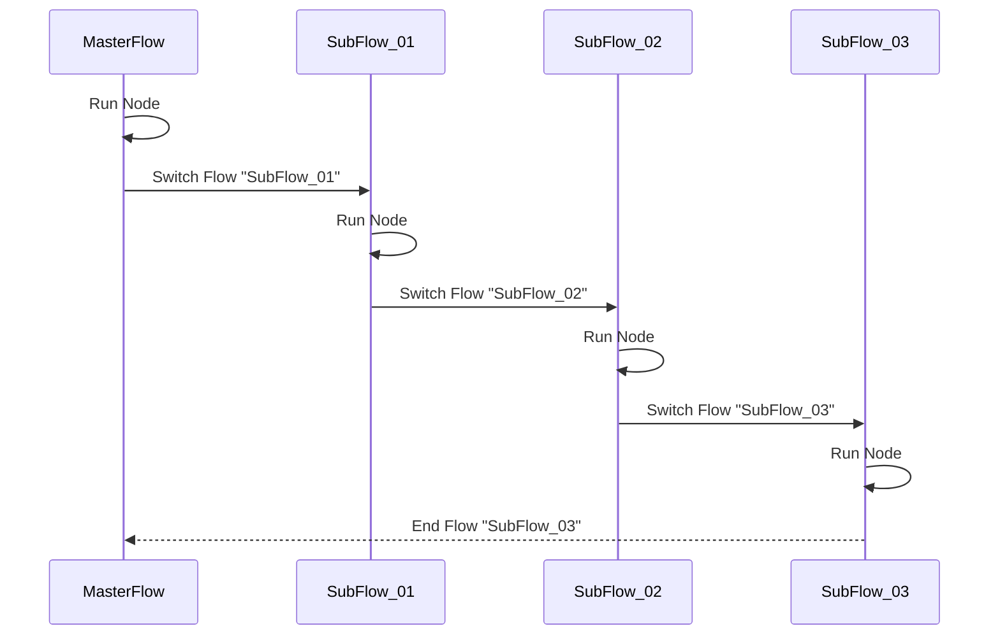

# Switch Flow

> 切換流程 (Flow)

> **不支援在模組流程 (Module Flow)，開啟子流程 (Subflow)**


## ◆ Schema

繼承自 [Base Node](../BaseDialogNode.md)

| 屬性 | 資料型態 | 必要屬性 | 描述   | 支援變數 | 版本 |
| ---------- | ------ | -------- | --------------- | ---------- | ---------- |
| *Id*        | string                                  | Y        | Node ID `(唯一，且不得和Node ID重複)`                | **X**                  | 1.0                       |
| *Name*      | string                                  | N        | Node 名稱                                           | **X**                         | 1.0                              |
| *Description* | string                                  | N        | Node 描述                                           | **X**                         | 1.0                              |
| *Type*      | string                                  | Y        | Node 類型，值為 `flow.switch`        | **X**                         | 1.0                              |
| *Message* | [MessageContent](../../MessageContent.md) | N | 訊息內容 `(二擇一)` | **X** | 1.0 |
| *Messages* | [MessageContent[]](../../MessageContent.md) | N | 訊息內容 `(二擇一)` | **X** | 1.0 |
| **FlowId** | string | Y        | 呼叫的 Flow ID | **O** | 1.0 |
| **Arguments** | Dictionary<string, [Argument](#-argument)> | Y | 指派呼叫的 Module Flow 的流程變數<br />**v1.14 以上的 Value 由 object 調整為 [Argument](#-argument)** | **X** | 1.14 |
| *Actions*   | [NodeAction[]](../../Actions/NodeAction.md) | Y        | Node 轉換行為 `(至少一個)`，即 Transition Condition | **X** | 1.0 |
| *VariableActions* | [VariableAction[]](../../Variables/VariableAction.md) | N | 處理自訂變數 | **X** | 1.0 |

### ● Argument

| 屬性   | 資料型態 | 必要屬性 | 描述                                 | 支援變數 | 版本 |
| ------ | -------- | -------- | ------------------------------------ | -------- | ---- |
| $Type  | string   | Y        | 引數的類型，預設值：`use_expression` | **X**    | 1.14 |
| $Value | object   | Y        | 引數的值                             | `[1]`    | 1.14 |

* `[1]` 是否支援變數會以 **$Type** 的值而定
    * **$Type** 為 `use_expression` 時，支援變數
    * **$Type** 為 `plain` 時，不支援變數
    * **$Type** 為 `variable` 時，直接使用指定變數的值，不處理任何運算
        * 如果設定多組變數時，只會使用第一個變數
        * 例如："`{{$.Variables.Var1}} {{$.Variables.Var2}}`"，只會取出變數 `$.Variables.Var1` 的值

#### ● Argument Type

| 指派方式/類型    | 描述                                                         |
| ---------------- | ------------------------------------------------------------ |
| `use_expression` | Argument Value 會處理任何資料綁定                            |
| `plain`          | Argument Value 不處理任何資料綁定 **`(不處理任何變數運算)`** |
| `variable`       | 指派指定變數，不處理任何資料綁定，只處理1個變數 **`(不處理任何變數運算)`** |

* **v1.14 之前的 Arguments Schema**

```json
{
    "Type": "flow.begin",
    "FlowId": "flow_000001",
    "Arguments": {
        "CardContent": "{{$.FlowVariables.CardContent}}",
        "Title": "Hello World"
    }
}
```

* **v1.14 之後的 Arguments Schema**

```json
{
    "Type": "flow.begin",
    "FlowId": "flow_000001",
    "Arguments": {
        "CardContent": {
            "$Type": "use_expression",
            "$Value": "{{$.FlowVariables.CardContent}}"
        },
        "Title": {
            "$Type": "use_expression",
            "$Value": "Hello World"
        }
    }
}
```


## ◆ Node Lifecycle

### ■ 輸入

* **使用者訊息 (User Message)**
    * 無

* **節點設定 (Node Setting)**
    * **Message** ─ 發送給使用者需要的內容 (1個)
    * **Messages** ─  發送給使用者需要的內容 (多個)
        * **Message** 與 **Messages** 二擇一選擇
    * **FlowId** ─  要切換的 Flow ID
    * **Actions** ─ 依據使用者輸入，轉換到對應的 Node
        * **`限定 1 個`**
        * **強烈建議 Node Action Type 設為 "none"**

### ■ 節點運作

> **不會等候使用者輸入**，因此設計時需要留意無窮迴圈

* **OnBeginNode**  `(Turn 1)`

    * **Step.1** 顯示訊息內容 (可選設定)
    * **Step.2** 依據 依據 Flow Id 的設定，切換到指定流程
        * **Step.2a** 如果未指定 Flow 或是 Flow 不存在，則`結束所有 Flow`
* **OnEndNode**
    * **`子流程結束後不會回到這個節點`**
        * 與 **[BeginFlow](BeginFlow.md)** 不同的地方

#### ● Dialog Flow Sequence




### ■ 可使用的變數

* **在 Variable Action 中可使用的變數**
    * [**自動變數**](../../Variables/Variable.md#-自動變數)
    * [**自訂變數**](../../Variables/Variable.md#-自訂變數)
* **在 Node Action**
    * 無

### ■ 輸出

* **Node Output 後可使用的變數**
    * 下一個節點取值
        * **`$.NodeOutput.From.NodeId`** ─ 從哪一個 Node 輸出
        * **`$.NodeOutput.From.FlowId`** ─ 從哪一個 Flow 輸出
        * ...
```json
{
    "Type": "null",
    "Data": null,
    "From": {
        "BotId": "",
        "FlowId": "",
        "FlowName": "",
        "NodeId": "",
        "NodeName": "",
        "NodeType": "flow.switch",
        "Date": ""
    }
}
```


## ◆ Example


```json
{
    "Id": "node_00002",
    "Name": "Switch To Menu",
    "Description": "",
    "Type": "flow.switch",
    "Actions": [
        {
            "Rules": [],
            "Type": "none",
            "Priority": 50,
            "NextNodeId": ""
        }
    ],
    "Message": {
        "Type": "text",
        "Text": "正在返回主選單"
    },
    "FlowId": "flow_00001",
    "Arguments": {
        "LeaveDate": "2020-01-16",
        "StartLeaveTime": "08:30",
        "EndLeaveTime": "17:30"
    }
}
```


