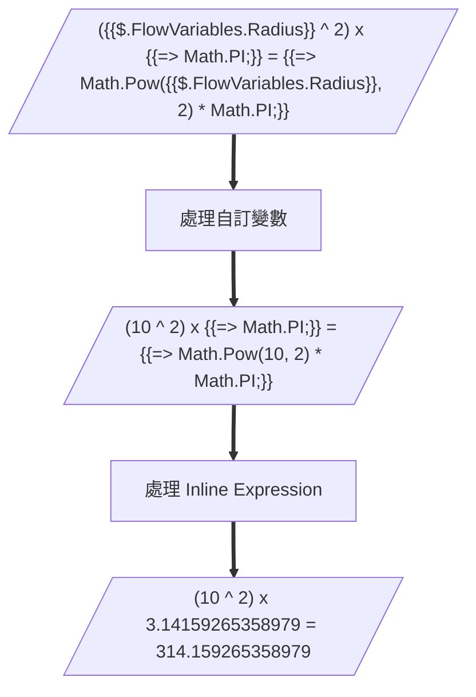
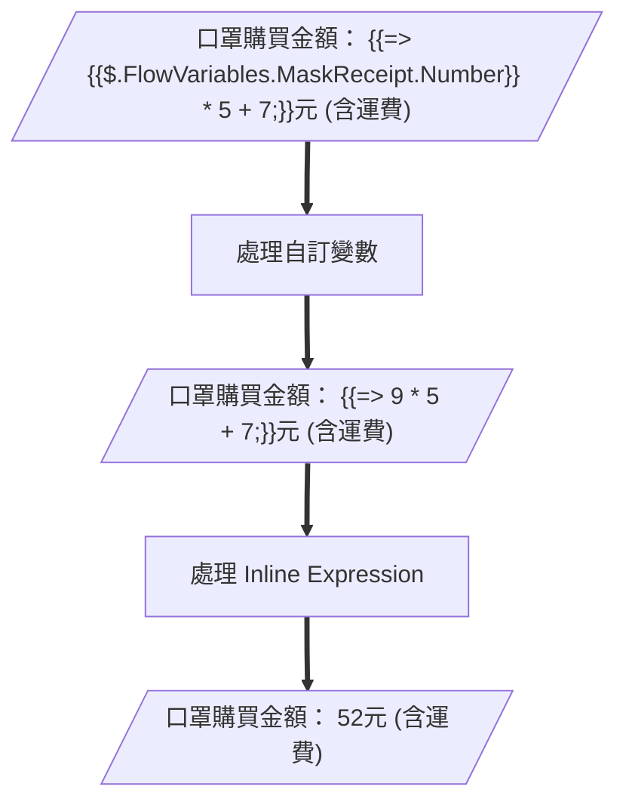

# Inline Expression

> Inline Expression 為實驗中的功能

* **[Expression](../Expression.md)**


## ◆ 使用限制

1. 只要變數能夠使用的地方，皆可以使用
2. 可以使用的功能同其他地方使用的 evaluate_expression


## ◆ 注意事項

* **使用前請先看過 [Expression 文件](../Expression.md)**
* 僅支援 C#
* 目前使用 [Codingseb Expression Evaluator](https://github.com/codingseb/ExpressionEvaluator) 做為 Expression Evaluator 
    * 某些語法可能不支援，[詳細支援表](https://github.com/codingseb/ExpressionEvaluator/wiki/Operators-and-Keywords#standard-operators)，不支援表中的 [Scripts keywords](https://github.com/codingseb/ExpressionEvaluator/wiki/Operators-and-Keywords#scripts-keywords) 列出的項目
    * [Live Demo](https://dotnetfiddle.net/Packages/41132/CodingSeb_ExpressionEvaluator)
* 可以搭配使用 JSON Path 取出變數值，並執行運算，詳細請往下查看
    * 使用 JSON Path 取出變數值時，則必須以 `{{JSON Path}}` 的方式表達
* 目前提供的 C# Namespace，[詳細說明請參考這裡](https://git.gss.com.tw/fpsbu/c.ai/GssBotMessageContent/-/blob/master/Docs/CSharpDataBinder.md)
    * 不支援 Inline Namespace 使用
        * 例如：`System.DateTime.Now` (不支援)，`DateTime.Now` (支援)

```
// 內建
System
System.Text
System.Text.RegularExpressions
System.Linq
System.Collections
System.Collections.Generic
System.Collections.Specialized
System.Xml
System.Xml.Linq
System.Xml.XPath
System.Globalization

// 常用套件
Newtonsoft.Json
Newtonsoft.Json.Linq

// Bot Builder 內建函式
GSS.BotBuilder.BotMessageDataBinder.Evaluators.Functions
GSS.BotBuilder.BotMessageDataBinder.Evaluators.Functions.Cryptography
GSS.BotBuilder.BotMessageDataBinder.Evaluators.Functions.Cryptography.Encoders
```


## ◆ 使用格式

* **字首為 `{{=>` 開頭**
* **字尾為 `;}}`結束**
* **中間為指定的運算式**
    * **`中間的運算式不支援變數取代`**

```
{{=> <Your Expression>;}}
```


## ◆ Example

### ● 日期

* **Message Content**

```json
{
    "Type": "text",
    "Text": "今天是{{=> DateTime.Today.ToString(\"yyyy年MM月dd日\");}}"
}
```

* **Output**

```
今天是2020年01月01日
```


### ● 數學運算

* **Message Content**

```json
{
    "Type": "text",
    "Text": "(5 ^ 2) x {{=> Math.PI;}} = {{=> Math.Pow(5, 2) * Math.PI;}}"
}
```

* **Output**

```
(5 ^ 2) x 3.14159265358979 = 78.5398163397448
```


### ● GUID、亂數、時間戳記

```json
[
    {
    	"Type": "text",
    	"Text": "GUID: {{=> Guid.NewGuid().ToString();}}"
	},
    {
    	"Type": "text",
    	"Text": "Random Number: {{=> (new Random()).Next(0, 1000).ToString();}}"
	},
    {
    	"Type": "text",
    	"Text": "Timestamp: {{=> DateTime.Now.Ticks;}}"
	}
]
```

* **Output**

```
GUID: 99424aa0-4fbc-4b0b-8e00-adc665bf799b
Random Number: 719
Timestamp: 637225472493990560
```


### ● 自訂變數 (作法一)

* **混合自訂變數 (`{{$.<VariablePath>}}`) 和 Inline Expression (`{{=> <Expression>;}}`)**
    * 建議使用這種作法

* **Variables**
    * `$.FlowVariables.Radius` 為 `10`
    * `$.FlowVariables.MaskReceipt` 為一個物件

```json
{
    "Customer": "張三",
    "Phone": "0987123456",
    "Number": 9,
    "Date": "2020/04/01"
}
```

* **Message Content**

```json
[
    {
        "Type": "text",
        "Text": "({{$.FlowVariables.Radius}} ^ 2) x {{=> Math.PI;}} = {{=> Math.Pow({{$.FlowVariables.Radius}}, 2) * Math.PI;}}"
    },
    {
        "Type": "text",
        "Text": "__口罩購買金額：__ {{=> {{$.FlowVariables.MaskReceipt.Number}} * 5 + 7;}}元 (含運費)"
    },
]
```

* **Output**

```
(10 ^ 2) x 3.14159265358979 = 314.159265358979
口罩購買金額： 52元 (含運費)
```

* **自訂變數 (`{{$.<VariablePath>}}`) 與 Inline Expression (`{{=> <Expression>;}}`) 的處理順序**






### ● 自訂變數 (作法二)

* **完全使用 Inline Expression (`{{=> <Expression>;}}`)**
    * 建議使用作法一，作法一相對比較簡單，且不容易發生問題

* **Variables**
    * `$.FlowVariables.Radius` 為 `10`
    * `$.FlowVariables.MaskReceipt` 為一個物件

```json
{
    "Customer": "張三",
    "Phone": "0987123456",
    "Number": 9,
    "Date": "2020/04/01"
}
```

* **Message Content**

```json
[
    {
        "Type": "text",
        "Text": "({{=> FlowVariables[\"Radius\"];}} ^ 2) x {{=> Math.PI;}} = {{=> Math.Pow(Convert.ToDouble(FlowVariables[\"Radius\"]), 2) * Math.PI;}}"
    },
    {
        "Type": "text",
        "Text": "__口罩購買金額：__ {{=> Convert.ToInt32(FlowVariables[\"MaskReceipt\"][\"Number\"]) * 5 + 7;}}元 (含運費)"
    },
    {
        "Type": "text",
        "Text": "__口罩購買金額：__ {{=> Convert.ToInt32(FlowVariables.SelectToken(\"$.MaskReceipt.Number\")) * 5 + 7;}}元 (含運費)"
    }
]
```

* **Output**

```
(10 ^ 2) x 3.14159265358979 = 314.159265358979
口罩購買金額： 52元 (含運費)
口罩購買金額： 52元 (含運費)
```

* **Inline Expression 可以使用的變數**
    * 除了少部分的地方以外 (例如：Rule、部分的 Card)，大多可以在 Expression 使用以下變數
    * 資料型態皆為 `JToken`，因此取值的方式同 `JToken`

| Variable          | Data Type | Description               |
| ----------------- | --------- | ------------------------- |
| **Message**       | JToken    | [自動變數] 訊息內容       |
| **Conversation**  | JToken    | [自動變數] 對話資訊       |
| **DialogState**   | JToken    | [自動變數] 對話狀態       |
| **Configs**       | JToken    | [自動變數] 設定資料       |
| **NodeOutput**    | JToken    | [自動變數] 前一個節點輸出 |
| **Variables**     | JToken    | [自訂變數] 全域變數       |
| **FlowVariables** | JToken    | [自訂變數] 流程變數       |

