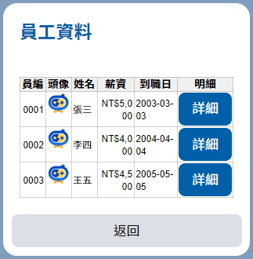

# LINE Grid Card Content

> 制式的Line Flex Message 訊息，表格卡片


##  ◆ Screenshot  





## ◆ Channel Support

> [LINE Flex Message 文件](https://developers.line.biz/en/reference/messaging-api/#message-objects)

| Channel 類型        | 是否支援 | 備註 |
| ------------------- | -------- | ---- |
| Emulator            | **X**    |      |
| Web Chat            | **X**    |      |
| iota                | **X**    |      |
| LINE                | **O**    |      |
| Slack               | **X**    |      |
| Webex               | **X**    |      |
| Facebook Messenger  | **X**    |      |
| WhatsApp            | **X**    |      |
| Teams               | **X**    |      |
| Telegram            | **X**    |      |
| WeChat              | **X**    |      |
| DingTalk            | **X**    |      |
| Apple Business Chat | **X**    |      |


## ◆ Schema

繼承自 [MessageContent](../MessageContent.md)

| 屬性                              | 資料型態                                        | 必要屬性 | 描述                                                   | 支援變數 | 版本 |
| --------------------------------- | ----------------------------------------------- | -------- | ------------------------------------------------------ | -------- | ---- |
| *Type*                            | string                                          | Y        | 類型，值為 `line.flex.card.grid`                       | **X**    | 1.5  |
| **AltText**                       | string                                          | Y        | 聊天室清單顯示的文字                                   | **O**    | 1.5  |
| **Title**                         | string                                          | N        | 標題                                                   | **O**    | 1.5  |
| **Columns**                       | [LineFlexGridColumn[]](#-line-flex-grid-column) | Y        | 資料欄定義                                             | **X**    | 1.5  |
| **Row**                           | [LineFlexGridRow](#-line-flex-grid-row)         | N        | 資料列定義                                             | **X**    | 1.5  |
| [**Style**](#-grid-style-options) | <string, string>                                | N        | UI 樣式 (表格)                                         | **X**    | 1.5  |
| **Buttons**                       | [LineActionContent[]](LineActionContent.md)     | N        | 卡片按鈕                                               | **X**    | 1.5  |
| **DataSource**                    | string                                          | Y        | 指定資料來源 (自訂變數)，**`必須指定`**                | **O**    | 1.5  |
| **EmptyDataText**                 | string                                          | N        | 未指定資料來源、資料為空時的提示訊息，有預設的提示訊息 | **O**    | 1.5  |
| **Locale**                        | string                                          | N        | 地區，用於處理文字格式化，預設值為伺服器所使用的地區   | **X**    | 1.5  |
| *QuickReply*                      | [LineButtonContent[]](LineActionContent.md)     | N        | 快速回覆按鈕                                           | **X**    | 1.1  |

> **AltText 必須要給值，值要給有效值字元、不能給空白字元**

* **AltText 在 LINE 上的顯示**


* **Locale**
  * [Locale Code](http://www.codedigest.com/CodeDigest/207-Get-All-Language-Country-Code-List-for-all-Culture-in-C---ASP-Net.aspx)


### ■ Line Flex Grid Column

| 資料類型  | 欄位類型                         | 描述     | 版本 |
| --------- | -------------------------------- | -------- | ---- |
| `string`  | [Text Column](#-text-column)     | 字串     | 1.5  |
| `integer` | [Text Column](#-text-column)     | 整數     | 1.5  |
| `float`   | [Text Column](#-text-column)     | 浮點數   | 1.5  |
| `date`    | [Text Column](#-text-column)     | 日期時間 | 1.5  |
| `image`   | [Image Column](#-image-column)   | 圖片     | 1.5  |
| `button`  | [Button Column](#-button-column) | 按鈕     | 1.5  |

#### ● Text Column

| 屬性                            | 資料型態         | 必要屬性 | 描述                     | 支援變數 | 指定 DataSource | 版本 |
| ------------------------------- | ---------------- | -------- | ------------------------ | -------- | --------------- | ---- |
| Id                              | string           | Y        | 欄位索引，**`不得重複`** | **X**    | **X**           | 1.5  |
| Title                           | string           | Y        | 標題                     | **O**    | **X**           | 1.5  |
| ContentType                     | string           | Y        | 資料類型，預設值：`text` | **X**    | **X**           | 1.5  |
| Value                           | string           | Y        | 資料                     | **X**    | **O**           | 1.5  |
| [Style](#-column-style-options) | <string, string> | N        | UI 樣式 (欄)             | **X**    | **X**           | 1.5  |

#### ● Image Column

* 如果要設定 Image Tap，請清除 Row Tap 的設定

| 屬性                            | 資料型態                                                     | 必要屬性 | 描述                     | 支援變數 | 指定 DataSource | 版本 |
| ------------------------------- | ------------------------------------------------------------ | -------- | ------------------------ | -------- | --------------- | ---- |
| Id                              | string                                                       | Y        | 欄位索引，**`不得重複`** | **X**    | **X**           | 1.5  |
| Title                           | string                                                       | Y        | 標題                     | **O**    | **X**           | 1.5  |
| ContentType                     | string                                                       | Y        | 資料類型，值為`image`    | **X**    | **X**           | 1.5  |
| Value                           | string                                                       | Y        | 圖片連結                 | **X**    | **O**           | 1.5  |
| Action                          | [AdaptiveSelectActionContent](ActionContent.md#adaptive-select-action-content) | N        | 點擊事件                 | **X**    | **X**           | 1.5  |
| [Style](#-column-style-options) | <string, string>                                             | N        | UI 樣式 (欄)             | **X**    | **X**           | 1.5  |

#### ● Button Column

* 請清除 Row Tap 的設定，`使用時注意欄寬`

| 屬性                            | 資料型態                                  | 必要屬性 | 描述                     | 支援變數 | 指定 DataSource  | 版本 |
| ------------------------------- | ----------------------------------------- | -------- | ------------------------ | -------- | ---------------- | ---- |
| Id                              | string                                    | Y        | 欄位索引，**`不得重複`** | **X**    | **X**            | 1.5  |
| Title                           | string                                    | Y        | 標題                     | **O**    | **X**            | 1.5  |
| ContentType                     | string                                    | Y        | 資料類型，值為`button`   | **X**    | **X**            | 1.5  |
| Action                          | [LineActionContent](LineActionContent.md) | N        | 點擊事件                 | **X**    | **O** (標題和值) | 1.5  |
| [Style](#-column-style-options) | <string, string>                          | N        | UI 樣式 (欄)             | **X**    | **X**            | 1.5  |


### ■ Line Flex Grid Row

> 建議如果有設定 Button Column Action 或 Image Column Tap，請擇一清除設定，以避免不必要的問題

| 屬性 | 資料型態                                  | 必要屬性 | 描述     | 支援變數 | 指定 DataSource | 版本 |
| ---- | ----------------------------------------- | -------- | -------- | -------- | --------------- | ---- |
| Tap  | [LineActionContent](LineActionContent.md) | N        | 點擊事件 | **X**    | **O** (Tap 值)  | 1.5  |


## ◆ Example

### ■ 指定 DataSouce 內容

* **變數名稱** ─ `$.Variables.Employee`

```json
[
    {
        "Id": "1",
        "Name": "張三",
        "Pay": "50000",
        "StartDate": "2003-03-03"
    },
    {
        "Id": "2",
        "Name": "李四",
        "Pay": "40000",
        "StartDate": "2004-04-04"
    },
    {
        "Id": "3",
        "Name": "王五",
        "Pay": "45000",
        "StartDate": "2005-05-05"
    }
]
```

* **Json (資料列提供點擊)**


```json
{
    "Type": "line.flex.card.grid",
    "AltText": "員工資料",
    "Title": "XX公司員工資料",
    "Columns": [
        {
            "ContentType": "integer",
            "Id": "Id",
            "Title": "員編",
            "Value": "{{$.Id}}",
            "Styles": {
                "Width": "40",
                "TextFormat": "0000"
            }
        },
        {
            "ContentType": "image",
            "Id": "Avatar",
            "Title": "頭像",
            "Value": "https://xxx.com.tw/HRService/avatar/id/{{$.Id}}",
            "Action": null,
            "Styles": {
                "Width": "40"
            }
        },
        {
            "ContentType": "string",
            "Id": "Name",
            "Title": "姓名",
            "Value": "{{$.Name}}",
            "Action": null,
            "Styles": {
                "Width": "40"
            }
        },
        {
            "ContentType": "string",
            "Id": "Pay",
            "Title": "薪資",
            "Value": "{{$.Pay}}",
            "Action": null,
            "Styles": {
                "Width": "60",
                "TextFormat": "C0"
            }
        },
        {
            "ContentType": "string",
            "Id": "StartDate",
            "Title": "到職日",
            "Value": "{{$.StartDate}}",
            "Styles": {
                "Width": "70",
                "TextFormat": "yyyy-MM-dd"
            }
        }
    ],
    "Row": {
        "Tap": {
            "Type": "postback",
            "Title": "詳細",
            "Value": "{{$.Id}}#Detial"
        }
    },
    "Buttons": [
        {
            "Type": "postback",
            "Title": "返回",
            "Value": "Back"
        }
    ],
    "DataSource": "$.Variables.Employee",
    "Styles": {
        "CardTitleSize": "xl",
        "CardTitleColor": "#0061AD"
    },
    "Locale": ""
}
```

* **Json (提供按鈕點擊)**


> **注意：在設計時按鈕會因為欄寬的關係，按鈕文字可能會變成「...」**

```json
{
    "Type": "line.flex.card.grid",
    "AltText": "員工資料",
    "Title": "XX公司員工資料",
    "Columns": [
        {
            "ContentType": "integer",
            "Id": "Id",
            "Title": "員編",
            "Value": "{{$.Id}}",
            "Styles": {
                "Width": "40",
                "TextFormat": "0000"
            }
        },
        {
            "ContentType": "image",
            "Id": "Avatar",
            "Title": "頭像",
            "Value": "https://xxx.com.tw/HRService/avatar/id/{{$.Id}}",
            "Action": null,
            "Styles": {
                "Width": "40"
            }
        },
        {
            "ContentType": "string",
            "Id": "Name",
            "Title": "姓名",
            "Value": "{{$.Name}}",
            "Action": null,
            "Styles": {
                "Width": "40"
            }
        },
        {
            "ContentType": "string",
            "Id": "Pay",
            "Title": "薪資",
            "Value": "{{$.Pay}}",
            "Action": null,
            "Styles": {
                "Width": "60",
                "TextFormat": "C0"
            }
        },
        {
            "ContentType": "string",
            "Id": "StartDate",
            "Title": "到職日",
            "Value": "{{$.StartDate}}",
            "Styles": {
                "Width": "70",
                "TextFormat": "yyyy-MM-dd"
            }
        },
        {
            "ContentType": "button",
            "Id": "Action",
            "Title": "詳細資訊",
            "Action":{
                "Type": "postback",
                "Title": "詳細",
                "Value": "{{$.Id}}#Detial"
            },
            "Styles": {
                "Width": "95",
                "ButtonStyle": "primary",
                "ButtonColor": "#0061AD"
            }
        }
    ],
    "Row": {
        "Tap": null
    },
    "Buttons": [
        {
            "Type": "postback",
            "Title": "返回",
            "Value": "Back"
        }
    ],
    "DataSource": "$.Variables.Employee",
    "Styles": {
        "CardTitleSize": "xl",
        "CardTitleColor": "#0061AD"
    },
    "Locale": ""
}
```


## ◆ Grid Style Options

> 有需要在使用，沒有設定的項目會使用預設值

* [Flex Message Text Component 屬性參考](https://developers.line.biz/en/reference/messaging-api/#f-text)
* [Flex Message Box Component 屬性參考](https://developers.line.biz/en/reference/messaging-api/#box)
* [Flex Message Button Component 屬性參考](https://developers.line.biz/en/reference/messaging-api/#button)

| 樣式選項             | 說明                                                         | 支援變數 | 參考                                                         |
| -------------------- | ------------------------------------------------------------ | -------- | ------------------------------------------------------------ |
| CardTitleSize        | **[[Text]](https://developers.line.biz/en/reference/messaging-api/#f-text)** 卡片標題字型大小，預設： `md` | **X**    | `xxs`、`xs`、`sm`<br />、`md`、`lg`、`xl`、<br />`xxl`、`3x1`、`4xl`、`5xl` |
| CardTitleColor       | **[[Text]](https://developers.line.biz/en/reference/messaging-api/#f-text)** 卡片標題字型顏色，預設： `#000000` | **X**    | 符合 `#RRGGBB` or `#RRGGBBAA` 格式                           |
| CardTitleWeight      | **[[Text]](https://developers.line.biz/en/reference/messaging-api/#f-text)** 卡片標題字型粗細，預設： `bold` | **X**    | `regular`、`bold` (粗體)                                     |
| CardTitleAlignment   | **[[Text]](https://developers.line.biz/en/reference/messaging-api/#f-text)** 卡片標題對齊方式，預設： `start` | **X**    | `start` (靠左)、`center` (置中)、`end` (靠右)                |
| CardTitleStyle       | **[[Text]](https://developers.line.biz/en/reference/messaging-api/#f-text)** 卡片標題是否為斜體，預設： `normal` | **X**    | `normal`、`italic` (斜體)                                    |
| CardTitleDecoration  | **[[Text]](https://developers.line.biz/en/reference/messaging-api/#f-text)** 卡片標題是否加上底線或刪除線，預設： `none` | **X**    | `none`、`underline` (底線)、`line-through` (刪除線)          |
| CardButtonHeight     | **[[Button]](https://developers.line.biz/en/reference/messaging-api/#button)** 按鈕大小，預設：`sm` | **X**    | `sm`、`md`                                                   |
| CardButtonStyle      | **[[Button]](https://developers.line.biz/en/reference/messaging-api/#button)** 按鈕背景樣式，預設：`secondary` | **X**    | ● `link` ：連結<br />● `primary` ：白色標題、深色背景<br />● `secondary` ：黑色標題、淺色背景 |
| CardButtonColor      | **[[Button]](https://developers.line.biz/en/reference/messaging-api/#button)** 按鈕背景顏色，預設：`<未設定>` | **X**    | 符合 `#RRGGBB` or `#RRGGBBAA` 格式                           |
| NoDataTextSize       | **[[Text]](https://developers.line.biz/en/reference/messaging-api/#f-text)** 「無資料」文字字型大小，預設： `md` | **X**    | `xxs`、`xs`、`sm`<br />、`md`、`lg`、`xl`、<br />`xxl`、`3x1`、`4xl`、`5xl` |
| NoDataTextColor      | **[[Text]](https://developers.line.biz/en/reference/messaging-api/#f-text)** 「無資料」文字字型大小，預設： `md` | **X**    | 符合 `#RRGGBB` or `#RRGGBBAA` 格式                           |
| NoDataTextWeight     | **[[Text]](https://developers.line.biz/en/reference/messaging-api/#f-text)** 「無資料」文字字型粗細，預設： `bold` | **X**    | `regular`、`bold` (粗體)                                     |
| NoDataTextAlignment  | **[[Text]](https://developers.line.biz/en/reference/messaging-api/#f-text)** 「無資料」文字對齊方式，預設： `start` | **X**    | `start` (靠左)、`center` (置中)、`end` (靠右)                |
| NoDataTextStyle      | **[[Text]](https://developers.line.biz/en/reference/messaging-api/#f-text)** 「無資料」文字是否為斜體，預設： `normal` | **X**    | `normal`、`italic` (斜體)                                    |
| NoDataTextDecoration | **[[Text]](https://developers.line.biz/en/reference/messaging-api/#f-text)** 「無資料」文字是否加上底線或刪除線，預設： `none` | **X**    | `none`、`underline` (底線)、`line-through` (刪除線)          |
| NoDataTextBackground | **[[Box]](https://developers.line.biz/en/reference/messaging-api/#box)** 「無資料」文字的背景顏色，預設：`<無設定>` | **X**    | 符合 `#RRGGBB` or `#RRGGBBAA` 格式                           |
| HeaderBackground     | **[[Box]](https://developers.line.biz/en/reference/messaging-api/#box)** 表格標題列背景顏色，預設值：`#F0F0F0` | **X**    | 符合 `#RRGGBB` or `#RRGGBBAA` 格式                           |
| HeaderTextSize       | **[[Text]](https://developers.line.biz/en/reference/messaging-api/#f-text)** 表格標題列文字型大小，預設： `xs` | **X**    | `xxs`、`xs`、`sm`<br />、`md`、`lg`、`xl`、<br />`xxl`、`3x1`、`4xl`、`5xl` |
| HeaderTextColor      | **[[Text]](https://developers.line.biz/en/reference/messaging-api/#f-text)** 表格標題列字型顏色，預設： `#000000` | **X**    | 符合 `#RRGGBB` or `#RRGGBBAA` 格式                           |
| HeaderTextWeight     | **[[Text]](https://developers.line.biz/en/reference/messaging-api/#f-text)** 表格標題列字型粗細，預設： `bold` | **X**    | `regular`、`bold` (粗體)                                     |
| RowBackground        | **[[Box]](https://developers.line.biz/en/reference/messaging-api/#box)** 表格資料列文字的背景顏色，預設：`<無設定>` | **X**    | 符合 `#RRGGBB` or `#RRGGBBAA` 格式                           |
| RowTextSize          | **[[Text]](https://developers.line.biz/en/reference/messaging-api/#f-text)** 表格資料列文字型大小，預設： `xs` | **X**    | `xxs`、`xs`、`sm`<br />、`md`、`lg`、`xl`、<br />`xxl`、`3x1`、`4xl`、`5xl` |
| RowTextColor         | **[[Text]](https://developers.line.biz/en/reference/messaging-api/#f-text)** 表格資料列字型顏色，預設： `#000000` | **X**    | 符合 `#RRGGBB` or `#RRGGBBAA` 格式                           |
| RowTextWeight        | **[[Text]](https://developers.line.biz/en/reference/messaging-api/#f-text)** 表格資料列字型粗細，預設： `regular` | **X**    | `regular`、`bold` (粗體)                                     |
| GridBorderColor      | 表格框線顏色，預設： `#000000`                               | **X**    | 符合 `#RRGGBB` or `#RRGGBBAA` 格式                           |
| GridBorderStyle      | 表格框線樣式，預設：`grid`                                   | **X**    | ● `grid` ：表格框線<br />● `list` ：清單框線<br />● `none` ：無框線 |


## ◆ Column Style Options

> 有需要在使用，沒有設定的項目會使用預設值

* [Flex Message Image Component 屬性參考](https://developers.line.biz/en/reference/messaging-api/#f-image)
* [Flex Message Button Component 屬性參考](https://developers.line.biz/en/reference/messaging-api/#button)

| 樣式選項         | 說明                                                         | 支援變數 | 參考                                                         |
| ---------------- | ------------------------------------------------------------ | -------- | ------------------------------------------------------------ |
| Width            | 寬度 (權重值)，預設值：`50`                                  | **X**    |                                                              |
| TextAlignment    | 文字對齊方式，預設值： `auto`                                | **X**    | ● `auto`：自動<br />● `left`：靠左對齊<br />● `center`：置中<br />● `right`：靠又對齊 |
| TextFormat       | 文字的格式                                                   | **X**    | 請參考下方 **Text Format**                                   |
| ImageSize        | **[[Image]](https://developers.line.biz/en/reference/messaging-api/#f-image)** 圖片大小 | **X**    | `xxs`、`xs`、`sm`<br />、`md`、`lg`、`xl`、<br />`xxl`、`3x1`、`4xl`、`5xl`、`full` |
| ImageAspectMode  | **[[Image]](https://developers.line.biz/en/reference/messaging-api/#f-image)** 卡片項目圖片長寬排版，預設：`fit` | **X**    | ● `fit` ： 符合圖片<br />● `cover` ：延伸圖片                |
| ImageAspectRatio | **[[Image]](https://developers.line.biz/en/reference/messaging-api/#f-image)** 卡片項目圖片長寬比率，預設：`<無設定>` | **X**    | 符合 `{width}:{height}` 格式，例如：`1920:1080`              |
| ButtonHeight     | **[[Button]](https://developers.line.biz/en/reference/messaging-api/#button)** 按鈕大小，預設：`sm` | **X**    | `sm`、`md`                                                   |
| ButtonStyle      | **[[Button]](https://developers.line.biz/en/reference/messaging-api/#button)** 按鈕背景樣式，預設：`secondary` | **X**    | ● `link` ：連結<br />● `primary` ：白色標題、深色背景<br />● `secondary` ：黑色標題、淺色背景 |
| ButtonColor      | **[[Button]](https://developers.line.biz/en/reference/messaging-api/#button)** 按鈕背景顏色，預設：`<未設定>` | **X**    | 符合 `#RRGGBB` or `#RRGGBBAA` 格式                           |

* **Text Format**
    * [標準數值格式字串](https://docs.microsoft.com/zh-tw/dotnet/standard/base-types/standard-numeric-format-strings)
    * [自訂數值格式字串](https://docs.microsoft.com/zh-tw/dotnet/standard/base-types/custom-numeric-format-strings)
    * [標準日期和時間格式字串](https://docs.microsoft.com/zh-tw/dotnet/standard/base-types/standard-date-and-time-format-strings)
    * [自訂日期與時間格式字串](https://docs.microsoft.com/zh-tw/dotnet/standard/base-types/custom-date-and-time-format-strings)
    * [標準 TimeSpan 格式字串](https://docs.microsoft.com/zh-tw/dotnet/standard/base-types/standard-timespan-format-strings)
    * [自訂 TimeSpan 格式字串](https://docs.microsoft.com/zh-tw/dotnet/standard/base-types/custom-timespan-format-strings)