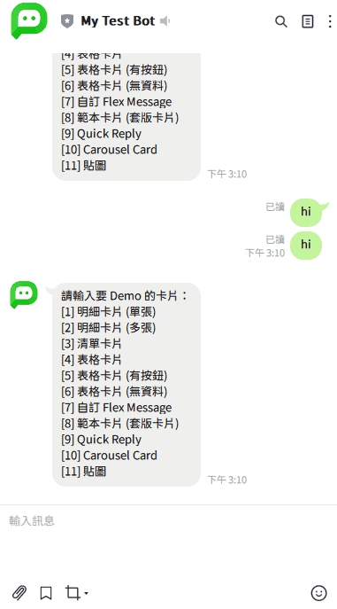
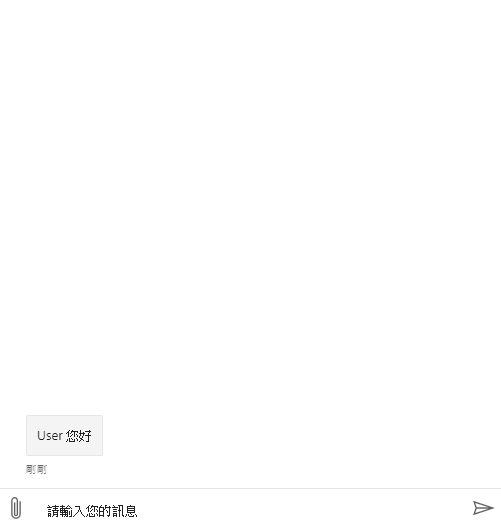

# Line Sticker Content

> 靜態的LINE 貼圖訊息，僅適用於 LINE


## ◆ Screenshot  




## ◆ Channel Support

> [LINE Flex Message 文件](https://developers.line.biz/en/reference/messaging-api/#message-objects)

| Channel 類型            | 是否支援 | 備註 |
| ----------------------- | -------- | ---- |
| Emulator                | **[1]**  |      |
| Web Chat、iota Chat Bot | **[1]**  |      |
| iota                    | **[1]**  |      |
| LINE                    | **O**    |      |
| Teams                   | **[1]**  |      |
| Slack                   | **[1]**  |      |
| Webex                   | **X**    |      |
| Facebook Messenger      | **X**    |      |
| WhatsApp                | **X**    |      |
| Telegram                | **X**    |      |
| M+                      | **X**    |      |
| WeChat (微信個人號)     | **X**    |      |
| WeCom (企業微信)        | **X**    |      |
| DingTalk                | **X**    |      |
| Apple Business Chat     | **X**    |      |

* `[1]` 支援貼圖顯示，但由於是抓取 LINE 預覽貼圖的連結，是否可以持續支援取決於 LINE 官方


## ◆ Schema

繼承 [MessageContent](MessageContent.md)

| 屬性            | 資料型態 | 必要屬性 | 描述                            | 支援變數 | 版本 |
| --------------- | -------- | -------- | ------------------------------- | -------- | ---- |
| *Type*          | string   | Y        | 類型，值為 `line.sticker`       | **X**    | 1.0  |
| **PackageId**   | string   | Y        | LINE Sticker Package ID         | **O**    | 1.28 |
| **StickerId**   | string   | Y        | LINE Sticker ID                 | **O**    | 1.28 |
| **IsAnimation** | bool     | N        | 是否為動態貼圖，預設值：`false` | **X**    | 1.28 |

* **`部分 LINE 貼圖是有版權的，使用前請注意該貼圖是否需要版權`**
    * **[LINE 官方貼圖的 Package ID、Sticker ID](https://developers.line.biz/en/docs/messaging-api/sticker-list/#sticker-definitions)**


## ◆ Example

### ● 固定內容 (靜態貼圖)

* 可以透過 `{{變數名}}` 動態塞入資料

```json
{
    "Type": "line.sticker",
    "PackageId": "11538",
    "StickerId": "51626494",
    "IsAnimation": false
}
```


### ● 固定內容 (動態貼圖)

* 可以透過 `{{變數名}}` 動態塞入資料

```json
{
    "Type": "line.sticker",
    "PackageId": "11538",
    "StickerId": "51626494",
    "IsAnimation": true
}
```


---

## ◆ 關於 Web Chat 模擬測試

* 將 LINE 貼圖訊息轉換成圖文卡片顯示
* **靜態貼圖**

```json
{
    "Type": "message",
    "Text": "",
    "Attachments": [
        {
            "ContentType": "application/vnd.microsoft.card.hero",
            "Content": {
                "Images": [
                    {
                        "url": "https://stickershop.line-scdn.net/stickershop/v1/sticker/51626494/android/sticker.png"
                    }
                ]
            }
        }
    ]
}
```

* **動態貼圖**

```json
{
    "Type": "message",
    "Text": "",
    "Attachments": [
        {
            "ContentType": "application/vnd.microsoft.card.hero",
            "Content": {
                "Images": [
                    {
                        "url": "https://stickershop.line-scdn.net/stickershop/v1/sticker/51626494/android/sticker_animation.png"
                    }
                ]
            }
        }
    ]
}
```


