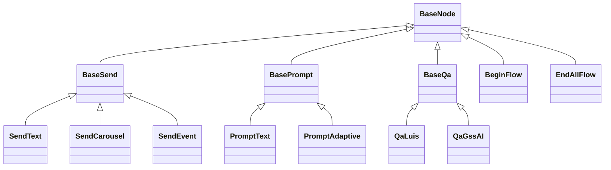
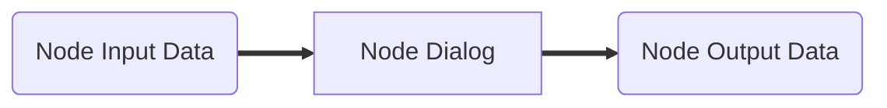

# Dialog Node

## ◆ Node Type

對話流程節點，節點類型如下：

#### ● Send Message

- [x] [Send Message](Send/SendMessage.md) ─ Bot 主動發送訊息給 User `(1.0)`
- [x] [Send Event](Send/SendEvent.md) ─ Bot 主動發送事件給 User `(1.1)`
- [x] [Send Carousel Attachment](Send/SendCarousel.md) ─ Bot 主動發送多個卡片或圖片給 User `(1.0)`
- [x] [Typing Message](Send/TypingMessage.md) ─ Bot 主動發送文字訊息給 User，訊息顯示帶有打字效果 `(2.10)`
    * 實驗性質的對話節點，限 Web Chat 4.18版以上支援

#### ● [Prompt](Prompt/BasePrompt.md)

> Bot 主動發送提示訊息給 User，並且等候 User 答覆後，處理後續的事情

- [x] [Prompt Text](Prompt/PromptText.md) ─ Bot 要求輸入文字訊息 `(1.0)`
- [x] [Prompt Card](Prompt/PromptCard.md) ─ Bot 提問卡片回覆訊息 `(1.11)`
- [x] ~~[Prompt Adaptive Card](Prompt/PromptAdaptiveCard.md) ─ Bot 提問卡片回覆訊息 `(1.0)`~~ → **變更為 Prompt Card**
#### ● [QA / NLU](QA/BaseQA.md)

> Bot 被動等候 User 提問，並答覆 User 的**「意圖」**或是**「問題」**

- [x] [QA (Regex)](QA/QARegex.md) ─ 使用 Regex 處理 User 的**「意圖」** `(1.0)`
- [x] [QA (LUIS.AI)](QA/QALuis.md) ─ 使用 Microsoft LUIS 處理 User 的**「意圖」** `(1.0)`
- [x] [QA (Gss.AI)](QA/QAGssAI.md) ─ 使用 GSS AI 處理 User 的**「意圖」**或**「問題」** `(1.0)`
- [x] [QA (Gss.QA)](QA/QAGssQA.md) ─ 使用 GSS QA 處理 User 的**「問題」** `(1.0)` 

#### ● AI Services

- [x] [Azure Open AI Chat](AI/AzureOpenAIChat.md) ─ 整合 Azure Open AI Chat API `(2.10)`

#### ● Flow

> 流程控制相關操作

- [x] [Begin Flow](FlowControl/BeginFlow.md) ─ 開始其他流程 (巢狀流程) `(1.0)`
- [ ] ~~[Begin Module Flow](FlowControl/BeginModuleFlow.md) ─ 開始模組流程， **同 Begin Flow** 處理邏輯 `(1.10)`~~
- [x] [Switch Flow](FlowControl/SwitchFlow.md) ─ 切換其他流程 (非巢狀流程) `(1.0)`
- [x] [End Current Flow](FlowControl/EndCurrentFlow.md) ─ 結束目前流程 `(1.0)`
- [ ] ~~[End Module Flow](FlowControl/EndModuleFlow.md) ─ 結束模組流程， **同 End Current Flow** 處理邏輯 `(1.10)`~~
- [x] [End All Flow](FlowControl/EndAllFlow.md) ─ 結束所有流程 `(1.0)`

#### ● Variable

> 變數設定處理、決策處理

- [x] [Variable](VariableControl/VariableDecision.md) ─  變數決策節點 `(1.0)`

#### ● Request External Service

> 外部服務處理

- [x] [Request Raw Data](External/RequestRawData.md) ─ 呼叫API (JSON、XML、Form Data) `(1.6)`
- [x] [Request Raw Json](External/RequestRawJson.md) ─ 呼叫API (JSON) `(1.0)` **`(未來版本可能會移除，1.6版以後的版本建議改用 Request Raw Data)`**
- [x] [Request Form Data](External/RequestFormData.md) ─ 呼叫API (Form Data)  `(1.0)`
- [x] [Parellel Request Raw Data](External/ParallelRequest.md) ─ 同時呼叫多個API `(1.25)`
- [x] [Multicast Request Raw Data](External/MulticastRequest.md) ─ 同時呼叫多個API `(1.27)`
- [x] [Request Raw Data Or Binary](External/RequestRawDataOrBinary.md) ─ 呼叫API (JSON、XML、Form Data、Binary File)  (`2.x`)

#### ● Trace

> 偵錯、錯誤紀錄處理

- [x] [Trace](Trace/Trace.md) ─ 發送偵錯訊息 (使用 Trace Activity) 給 Channel 端 `(1.1)`

#### ● Custom

> 客製化節點

- [x] [Custom Dialog](Custom/CustomDialog.md) ─ 開始自訂的對話  `(1.2)`
    - [x] [GssCaiDialog](https://git.gss.com.tw/fpsbu/gssbotdialogflowengineplugins/blob/master/Plugins/GssCaiDialogPlugin/Readme.md)  `(1.2)`
        * 提供 GSS C.AI 服務處理，功能有自然語言解析 (NLU)、智慧問答服務 (QA)
- [x] [Custom Function](Custom/CustomFunction.md) ─ 自訂函式處理  `(1.8)`

## ◆ Model

## ◆ Schema

### ■ Base Node

Base Node 基本的屬性

| 屬性  | 資料型態                             | 必要屬性 | 描述                                       | 版本                                     |
| ----------- | ---------------------------------------- | -------- | --------------------------------------------------- | --------------------------------------------------- |
| Id          | string                                   | Y        | Node ID `(唯一)`                                    | 1.0                                 |
| Name        | string                                   | N        | Node 名稱                                           | 1.0                                        |
| Description | string                                   | N        | Node 描述                                           | 1.0                                        |
| Type        | string                                   | Y        | Node 類型                                           | 1.0                                        |
| Actions     | [NodeAction[]](../Actions/NodeAction.md) | Y        | Node 轉換行為 `(至少一個)`，即 Transition Condition | 1.0 |
| VariableActions | [VariableAction[]](../Variables/VariableAction.md) | N | 處理自訂變數 | 1.0 |
| Delay | double | N | 延遲執行時間，預設：0，範圍：0 ~ 3000 毫秒 | 1.0 |

## ◆ Node Data Flow

* **Node Input Data**

| 屬性      | 資料型態        | 描述                                                 |
| --------- | --------------- | ---------------------------------------------------- |
| Message   | MessageActivity | 使用者前一個對話的訊息，即前一個 Node 輸出的 Message |
| InputData | JObject         | 變數和資料，前一個 Node 輸入的 OututData             |
| Node      | BaseDialogNode  | 節點資料                                             |
| NodeId    | string          | 這個節點的ID                                         |

* **Node Output Data**

| 屬性       | 資料型態        | 描述                                                 |
| ---------- | --------------- | ---------------------------------------------------- |
| Message    | MessageActivity | 使用者輸入對話的訊息，提供給下一個 Node 使用         |
| OutputData | JObject         | 這一個 Node 所產生的變數和資料，提供下一個 Node 使用 |
| NextNode   | string          | 下一個節點的 ID                                      |

