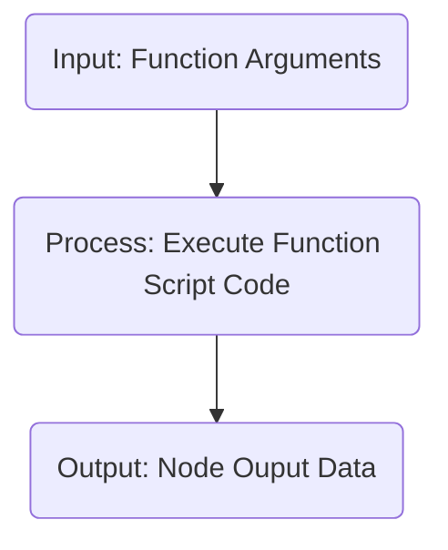

# Custom Function

> 為了滿足資料整理需求，可以透過自訂函式處理相關的資料


## ◆ Schema

繼承自 [Base Node](../BaseDialogNode.md)

| 屬性               | 資料型態                                              | 必要屬性 | 描述                                                         | 支援變數 | 版本 |
| ------------------ | ----------------------------------------------------- | -------- | ------------------------------------------------------------ | -------- | ---- |
| Id                 | string                                                | Y        | Node ID                                                      | **X**    | 1.8  |
| Name               | string                                                | N        | Node 名稱                                                    | **X**    | 1.8  |
| Description        | string                                                | N        | Node 描述                                                    | **X**    | 1.8  |
| Type               | string                                                | Y        | Node 類型，值為 `function`                                   | **X**    | 1.8  |
| **ScriptType**     | string                                                | Y        | 程式碼語言，預設值：`cs_script`                              | **X**    | 1.8  |
| **Arguments**      | List<[FunctionArgument](#-function-argument)>         | N        | 函式執行所需要的引數                                         | **X**    | 1.8  |
| **ScriptCode**     | string                                                | Y        | 程式碼                                                       | **X**    | 1.8  |
| **JavaScriptLibs** | [JavaScriptLibs](#-javascript-library)[]              | N        | 外部 JS 套件，限 **ScriptType** = `javascript`，[詳細請詳閱](#-javascript-使用須知) | **X**    | 1.25 |
| *Actions*          | [NodeAction[]](../../Actions/NodeAction.md)           | Y        | Node 轉換行為                                                | **X**    | 1.8  |
| *VariableActions*  | [VariableAction[]](../../Variables/VariableAction.md) | N        | 處理自訂變數                                                 | **X**    | 1.8  |


### ● Script Type

| 值           | 描述                                                 |
| ------------ | ---------------------------------------------------- |
| `cs_script`  | C# 語言，預設值，[詳細請詳閱](#-c-script-使用須知)   |
| `javascript` | JavaScript 語言，[詳細請詳閱](#-javascript-使用須知) |

### ● Function Argument

| 屬性      | 資料型態 | 必要屬性 | 描述                                                         | 支援變數 | 版本 |
| --------- | -------- | -------- | ------------------------------------------------------------ | -------- | ---- |
| **Name**  | string   | Y        | 引數名稱，在函式程式碼中使用的變數名稱 **(不得重複)**<br />● `__botVariables` 為保留變數名稱，不得使用這個變數名稱 | **X**    | 1.8  |
| **Type**  | string   | Y        | 引數的類型                                                   | **X**    | 1.14 |
| **Value** | object   | Y        | 引數的值                                                     | `[1]`    | 1.8  |

* `[1]` 是否支援變數會以 **Type** 的值而定
    * **Type** 為 `use_expression` 時，支援變數
    * **Type** 為 `plain` 時，不支援變數
    * **Type** 為 `variable` 時，直接使用指定變數的值，不處理任何運算
        * 如果設定多組變數時，只會使用第一個變數
        * 例如："`{{$.Variables.Var1}} {{$.Variables.Var2}}`"，只會取出變數 `$.Variables.Var1` 的值

#### ■ Argument Type

| 指派方式/類型    | 描述                                                         |
| ---------------- | ------------------------------------------------------------ |
| `use_expression` | Argument Value 會處理任何資料綁定                            |
| `plain`          | Argument Value 不處理任何資料綁定 **`(不處理任何變數運算)`** |
| `variable`       | 指派指定變數，不處理任何資料綁定，只處理1個變數 **`(不處理任何變數運算)`** |

* **v1.14 之前的 Arguments Schema**

```json
{
    "Type": "flow.module.begin",
    "FlowId": "cs_script",
    "ScriptCode": "",
    "Arguments": [
        {
            "Name": "CardContent",
            "Value": "{{$.FlowVariables.CardContent}}"
        },
        {
            "Name": "Title",
            "Value": "Hello World"
        }
    ]
}
```

* **v1.14 之後的 Arguments Schema**

```json
{
    "Type": "flow.module.begin",
    "FlowId": "cs_script",
    "ScriptCode": "",
    "Arguments": [
        {
            "Name": "CardContent",
            "Type": "use_expression",
            "Valie": "{{$.FlowVariables.CardContent}}"
        },
        {
            "Name": "Title",
            "Type": "use_expression",
            "Value": "Hello World"
        }
    ]
}
```


### ● JavaScript Library

| 屬性           | 資料型態 | 必要屬性 | 描述                                                         | 支援變數 | 版本 |
| -------------- | -------- | -------- | ------------------------------------------------------------ | -------- | ---- |
| **LocalLibs**  | string[] | N        | 值為指定的本機 JavaScript 檔案<br />‧目錄固定為網站目錄下的 `Packages/JavaScript` | **X**    | 1.25 |
| **RemoteLibs** | string[] | N        | 值為指定的 URL<br />‧加入從 CDN 上的JavaScript Library，**留意 JS 檔案大小會影響執行的時間** | **X**    | 1.25 |


---

## ◆ C# Script 使用須知

* 目前使用 [Codingseb Expression Evaluator](https://github.com/codingseb/ExpressionEvaluator) 做為 Expression Evaluator 
    * 某些語法可能不支援，例如：Switch Case
    * [詳細支援表](https://github.com/codingseb/ExpressionEvaluator/wiki/Operators-and-Keywords#standard-operators)，支援表中的 [Scripts keywords](https://github.com/codingseb/ExpressionEvaluator/wiki/Operators-and-Keywords#scripts-keywords) 列出的項目
    * [Live Demo](https://dotnetfiddle.net/Packages/41132/CodingSeb_ExpressionEvaluator)
    
* **`不可以搭配使用 JSON Path 取出變數值，也無法使用 Adaptive Expression 取出變數`**
    * 要使用的變數請預先設定在 Function Argument
* **不需要使用 [Inline Expression](../Variables/InlineExpression) 表示方式 (即 `{{=> Expression ;}}`)**
* **ScriptCode 的內容需要符合以下格式：**

    * 和 Inline Expression 實作方式差不多
        * 不需以 Arrow Function 的方式實作
        * 前後不用加上 `{{=>` 和 ` ;}}`
        * 允許多行
        * 可以使用 if else 處理邏輯判斷
        * **必需在最後一行加上 `return` 資料**
    * 變數的部分，依據 [Arguments](#-function-argument) 設定的內容直接拿出來使用
        * 變數的資料形態皆為弱型別 (`JToken`)，如果要存取內部成員需要透過 `ToObject<T>()` 轉換
            * 其中 `T` 為範型
    * Bot 的變數預設會以 `__botVariables` Arguments Name 放進去，因此可以從 `__botVariables`  取得Bot 變數
        * `__botVariables` 為保留的 Arguments Name
        * 目前先支援以下變數類型：
             * `__botVariables["Configs"]` ─ Bot 全域參數設定
    * 使用範例請[參考下面章節](#-Example)

```C#
var myData = data.ToObject<List<JToken>>();
return myData[0];
```

* 目前提供的 C# Namespace，[詳細說明請參考這裡](https://git.gss.com.tw/fpsbu/c.ai/GssBotMessageContent/-/blob/master/Docs/CSharpDataBinder.md)
    * 不支援 Inline Namespace 使用
        * 例如：`System.DateTime.Now` (不支援)，`DateTime.Now` (支援)

```
// 內建
System
System.Text
System.Text.RegularExpressions
System.Linq
System.Collections
System.Collections.Generic
System.Collections.Specialized
System.Xml
System.Xml.Linq
System.Xml.XPath
System.Globalization

// 常用套件
Newtonsoft.Json
Newtonsoft.Json.Linq

// Bot Builder 內建函式
GSS.BotBuilder.BotMessageDataBinder.Evaluators.Functions
GSS.BotBuilder.BotMessageDataBinder.Evaluators.Functions.Cryptography
GSS.BotBuilder.BotMessageDataBinder.Evaluators.Functions.Cryptography.Encoders
```


## ◆ JavaScript 使用須知

* 目前使用  [NiL.JS](https://github.com/nilproject/NiL.JS) 做為 Expression Evaluator
    * 支援 ES 6 的語法
* **`不可以搭配使用 JSON Path 取出變數值，也無法使用 Adaptive Expression 取出變數`**
    * 要使用的變數請預先設定在 Function Argument
* **不需要使用 [Inline Expression](../Variables/InlineExpression) 表示方式 (即 `{{=> Expression ;}}`)**
* **ScriptCode 的內容需要符合以下格式：**
    * 以 Arrow Function 的方式實作
    * 第一個參數 (`variables`) 為設定的 [Arguments](#-function-argument) 的內容變數
        * Bot 目前的變數從 `variables.__botVariables` 取得
        * 目前先支援以下變數類型：
            * `variables.__botVariables.Configs` ─ Bot 全域參數設定
    * 第二個參數 (`botVariables`) 為 Bot 變數資料
        * 也可從 `variables.__botVariables` 獲得這個物件
        * 目前先支援以下變數類型：
            * `botVariables.Configs` ： Bot 全域參數設定
    * 此 Function  必須 retrun 資料，資料的值會放在 `$.NodeOutput.Data` 變數裡
        * 如果想要將 Function Output 的值放到指定的變數中，請透過 VariableAction 處理
    * 使用範例請[參考下面章節](#-Example)

```javascript
(variables, botVariables) => {

    return returnValue;
}
```


## ◆ Node Lifecycle



### ■ 輸入

* **使用者訊息 (User Message)**
    * 無
* **節點設定 (Node Setting)**
    * **ScriptType** ─ 程式碼語言
    * **Arguments** ─ 函式執行所需要的引數
    * **ScriptCode** ─ 程式碼

### ■ 節點運作

> **不會等候使用者輸入**，因此設計時需要留意無窮迴圈

* **BeginCustomDialog**  `(Turn 1)`
    * **Step.1** 執行 Function Script
    * **Step.2** 取得 Function Return Value

### ■ 可使用的變數

* **在 Variable Action、Next Node Id 中可使用的變數**
    * [**自動變數**](../../Variables/Variable.md#-自動變數)
    * [**自訂變數**](../../Variables/Variable.md#-自訂變數)
* **在 Node Action Rules  中可使用的變數**
    * **`$.Data`** ─ 函式腳本執行結果

```json
{
    "Data": {}
}
```

### ■ 輸出

* **Node Output 後可使用的變數**
    * 下一個節點取值
        * **`$.NodeOutput.Data`** ─ 函式腳本執行結果

```json
{
    "Type": "ApiResponse",
	"Data": {},
    "From": {
        "BotId": "",
        "FlowId": "",
        "FlowName": "",
        "NodeId": "",
        "NodeName": "",
        "NodeType": "function",
        "Date": ""
    }
}
```


---

## ◆ Example

### ■ Input Source

* `$.Variables.UserProfile`

```json
[
    {
        "Id": "001",
        "Name": "Ace",
        "Ages": 16,
        "Birth": "1990-01-01"
    },
    {
        "Id": "011",
        "Name": "Jack",
        "Ages": 20,
        "Birth": "1986-11-11"
    },
    {
        "Id": "12",
        "Name": "Queen",
        "Ages": 40,
        "Birth": "1950-12-12"
    },
    {
        "Id": "013",
        "Name": "King",
        "Ages": 60,
        "Birth": "1930-01-13"
    },
    {
        "Id": "014",
        "Name": "Joker",
        "Ages": 25,
        "Birth": "1981-02-14"
    }
]
```


### ■ Script

#### ● Function A (C#)

* **JSON** 

```json
{
    "Id": "node_C0001",
    "Name": "FunctionNode A",
    "Description": "",
    "Type": "function",
    "Actions": [
        {
            "Rules": [],
            "Type": "none",
            "Priority": 50,
            "NextNodeId": ""
        }
    ],
    "ScriptType": "cs_script",
    "Arguments": [
        {
            "Name": "profiles",
            "Value": "$.Variables.UserProfile"
        }
    ],
    "ScriptCode": "return profiles.ToObject<List<JToken>>().Where(d => (int)d[\"Ages\"] > 20).ToList();",
    "VariableActions": []
}
```

* **Code**
    * 傳進去的 Arguments 的資料型態皆為 JToken，因此皆需要以 JToken 來處理

```c#
return profiles.ToObject<List<JToken>>().Where(d => (int)d["Ages"] > 20).ToList();
```


#### ● Function A (JavaScript)

* **JSON** 

```json
{
    "Id": "node_J0001",
    "Name": "FunctionNode A",
    "Description": "",
    "Type": "function",
    "Actions": [
        {
            "Rules": [],
            "Type": "none",
            "Priority": 50,
            "NextNodeId": ""
        }
    ],
    "ScriptType": "javascript",
    "Arguments": [
        {
            "Name": "profiles",
            "Value": "$.Variables.UserProfile"
        }
    ],
    "ScriptCode": "(variables, botVariables) => {\n	let filterList = [];\n	for (let profile of variables.profiles) {\n		if (profile.Ages > 20) {\n			filterList.push(profile);\n		}\n	}\n	return filterList;\n}",
    "JavaScriptLibs": {
        "LocalLibs": [],
        "RemoteLibs": []
    },
    "VariableActions": []
}
```


* **Code**
    * JavaScript 函式，**需要寫一個 Arrow Function**
        * 傳進去的 Arguments 會以 `variables` 作為一個集合，`$.Variables.UserProfile` → `variables.profiles`

```javascript
(variables, botVariables) => {
    let filterList = [];
    for (let profile of variables.profiles) {
        if (profile.Ages > 20) {
            filterList.push(profile);
        }
    }
    return filterList;
}
```


---

#### ● Function B (C#)

* **JSON** 

```json
{
    "Id": "node_C0002",
    "Name": "FunctionNode B",
    "Description": "",
    "Type": "function",
    "Actions": [
        {
            "Rules": [],
            "Type": "none",
            "Priority": 50,
            "NextNodeId": ""
        }
    ],
    "ScriptType": "cs_script",
    "Arguments": [
        {
            "Name": "profiles",
            "Value": "$.Variables.UserProfile"
        }
    ],
    "ScriptCode": "var profileList = profiles.ToObject<List<JToken>>();\nvar filterProfile = new List<object>();\nfor (int i = 0; i < profileList.Count; i++)\n{\n\tvar profile = profileList[i];\n\tif (profile[\"Name\"].ToString() == \"Queen\")\n\t{\n\t\tfilterProfile.Add(profile);\n\t}\n}\nreturn filterProfile;",
    "VariableActions": []
}
```

* **Code**
    * 傳進去的 Arguments 的資料型態皆為 JToken，因此皆需要以 JToken 來處理

```c#
var profileList = profiles.ToObject<List<JToken>>();
var filterProfile = new List<object>();
for (int i = 0; i < profileList.Count; i++)
{
    var profile = profileList[i];
    if (profile["Name"].ToString() == "Queen")
    {
        filterProfile.Add(profile);
    }
}
return filterProfile;
```


#### ● Function B (JavaScript)

* **JSON** 

```json
{
    "Id": "node_J0002",
    "Name": "FunctionNode B",
    "Description": "",
    "Type": "function",
    "Actions": [
        {
            "Rules": [],
            "Type": "none",
            "Priority": 50,
            "NextNodeId": ""
        }
    ],
    "ScriptType": "javascript",
    "Arguments": [
        {
            "Name": "profiles",
            "Value": "$.Variables.UserProfile"
        }
    ],
    "ScriptCode": "(variables, botVariables) => {\n	let filterList = [];\n	for (let profile of variables.profiles) {\n		if (profile.Name === 'Queen') {\n			filterList.push(profile);\n		}\n	}\n	return filterList;\n}",
    "JavaScriptLibs": {
        "LocalLibs": [],
        "RemoteLibs": []
    }
    "VariableActions": []
}
```


* **Code**
    * JavaScript 函式，**需要寫一個 Arrow Function**
        * 傳進去的 Arguments 會以 `variables` 作為一個集合，`$.Variables.UserProfile` → `variables.profiles`

```javascript
(variables, botVariables) => {
    let filterList = []
    for (let profile of variables.profiles) {
        if (profile.Name === 'Queen') {
            filterList.push(profile);
        }
    }
    return filterList;
}
```


---

#### ● Function C (C#)

* **JSON** 

```json
{
    "Id": "node_C0003",
    "Name": "FunctionNode C",
    "Description": "",
    "Type": "function",
    "Actions": [
        {
            "Rules": [],
            "Type": "none",
            "Priority": 50,
            "NextNodeId": ""
        }
    ],
    "ScriptType": "cs_script",
    "Arguments": [
        {
            "Name": "profiles",
            "Value": "$.Variables.UserProfile"
        }
    ],
    "ScriptCode": "var profileList = profiles.ToObject<List<JToken>>();\nvar filterProfile = new List<object>();\nint point = 0;\nfor (int i = 0; i < profileList.Count; i++)\n{\n\tvar profile = profileList[i];\n\tvar name = profile[\"Name\"].ToString();\n\tif (name == \"Ace\") \n\t{\n\t\tpoint += 1;\n\t}\n\telse if (name == \"Jack\") \n\t{\n\t\tpoint += 11;\n\t}\n\telse if (name == \"Queen\") \n\t{\n\t\tpoint += 12;\n\t}\n\telse if (name == \"King\") \n\t{\n\t\tpoint += 13;\n\t}\n\telse if (name == \"Joker\") \n\t{\n\t\tpoint += 14;\n\t}\n}\nreturn point;",
    "VariableActions": []
}
```

* **Code**
    * 傳進去的 Arguments 的資料型態皆為 JToken，因此皆需要以 JToken 來處理

```c#
var profileList = profiles.ToObject<List<JToken>>();
var filterProfile = new List<object>();
int point = 0;
for (int i = 0; i < profileList.Count; i++)
{
    var profile = profileList[i];
    var name = profile["Name"].ToString();
    if (name == "Ace")
    {
        point += 1;
    }
    else if (name == "Jack")
    {
        point += 11;
    }
    else if (name == "Queen")
    {
        point += 12;
    }
    else if (name == "King")
    {
        point += 13;
    }
    else if (name == "Joker")
    {
        point += 14;
    }
}
return point;
```


#### ● Function C (JavaScript)

* **JSON** 

```json
{
    "Id": "node_J0003",
    "Name": "FunctionNode C",
    "Description": "",
    "Type": "function",
    "Actions": [
        {
            "Rules": [],
            "Type": "none",
            "Priority": 50,
            "NextNodeId": ""
        }
    ],
    "ScriptType": "javascript",
    "Arguments": [
        {
            "Name": "profiles",
            "Value": "$.Variables.UserProfile"
        }
    ],
    "ScriptCode": "(variables, botVariables) => {\n	let point = 0;\n	for (let profile of variables.profiles) {\n		switch (profile.Name) {\n			case 'Ace':\n				point += 1;\n				break;\n			case 'Jack':\n				point += 11;\n				break;\n			case 'Queen':\n				point += 12;\n				break;\n			case 'King':\n				point += 13;\n				break;\n			case 'Joker':\n				point += 14;\n				break;\n		}\n	}\n	return point;\n}",
    "JavaScriptLibs": {
        "LocalLibs": [],
        "RemoteLibs": []
    }
    "VariableActions": []
}
```


* **Code**
    * JavaScript 函式，**需要寫一個 Arrow Function**
        * 傳進去的 Arguments 會以 `variables` 作為一個集合，`$.Variables.UserProfile` → `variables.profiles`

```javascript
(variables, botVariables) => {
    let point = 0;
    for (let profile of variables.profiles) {
        switch (profile.Name) {
            case 'Ace':
                point += 1;
                break;
            case 'Jack':
                point += 11;
                break;
            case 'Queen'
                point += 12;
                break;
            case 'King':
                point += 13;
                break;
            case 'Joker':
                point += 14;
                break;
        }
    }
    return point;
}
```


---

### ■ Output

#### ● Function A

```json
[
    {
        "Id": "12",
        "Name": "Queen",
        "Ages": 40,
        "Birth": "1950-12-12"
    },
    {
        "Id": "013",
        "Name": "King",
        "Ages": 60,
        "Birth": "1930-01-13"
    },
    {
        "Id": "014",
        "Name": "Joker",
        "Ages": 25,
        "Birth": "1981-02-14"
    }
]
```


#### ● Function B

```json
[
    {
        "Id": "12",
        "Name": "Queen",
        "Ages": 40,
        "Birth": "1950-12-12"
    }
]
```


#### ● Function C

```json
51
```

