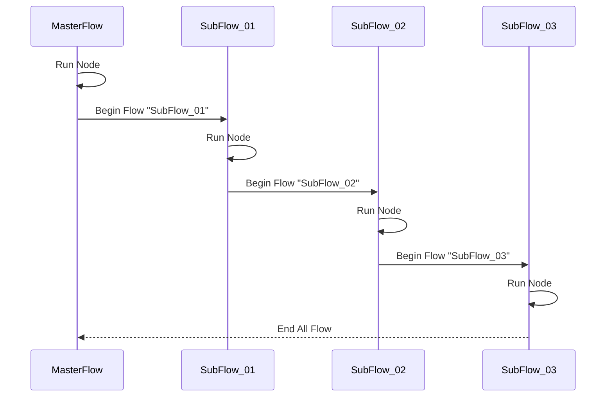

# End All Flow

>  結束所有的流程

> **不支援在模組流程 (Module Flow)，開啟子流程 (Subflow)**


## ◆ Schema

繼承自 [Base Node](../BaseDialogNode.md)

| 屬性  | 資料型態                                 | 必要屬性 | 描述                                       | 支援變數 | 版本 |
| ----------- | ---------------------------------------- | -------- | --------------------------------------------------- | ---------- | ---------- |
| *Id*        | string                                   | Y        | Node ID `(唯一，且不得和Node ID重複)`               | **X** | 1.0 |
| *Name*      | string                                   | N        | Node 名稱                                           | **X** | 1.0 |
| *Description* | string                                   | N        | Node 描述                                           | **X** | 1.0 |
| *Type*      | string                                   | Y        | Node 類型，值為 `flow.end.all`          | **X** | 1.0 |
| *Message* | [MessageContent](../../MessageContent.md) | N        | 訊息內容 `(二擇一)`                     | **X** | 1.0 |
| *Messages* | [MessageContent[]](../../MessageContent.md) | N | 訊息內容 `(二擇一)` | **X** | 1.0 |
| *Actions*   | [NodeAction[]](../../Actions/NodeAction.md) | Y        | Node 轉換行為 `(至少一個)`，即 Transition Condition | **X** | 1.0 |
| *VariableActions* | [VariableAction[]](../../Variables/VariableAction.md) | N | 處理自訂變數 | **X** | 1.0 |


## ◆ Node Lifecycle

### ■ 輸入

* **使用者訊息 (User Message)**
    * 無

* **節點設定 (Node Setting)**
    * **Message** ─ 發送給使用者需要的內容 (1個)
    * **Messages** ─  發送給使用者需要的內容 (多個)
        * **Message** 與 **Messages** 二擇一選擇
    * **Actions** ─ 依據使用者輸入，轉換到對應的 Node
        * **`為 0 個`**

### ■ 節點運作

> **不會等候使用者輸入**，因此設計時需要留意無窮迴圈

* **OnBeginNode**  `(Turn 1)`

    * **Step.1** 顯示訊息內容 (可選設定)
    * **Step.2** 結束所有的流程對話

#### ● Dialog Flow Sequence




### ■ 可使用的變數

* **在 Variable Action**
    * [**自動變數**](../../Variables/Variable.md#-自動變數)
    * [**自訂變數**](../../Variables/Variable.md#-自訂變數)
* **在 Node Action**
    * 無

### ■ 輸出

* **Node Output 後可使用的變數**
    * 下一個節點取值
        * **`$.NodeOutput.From.NodeId`** ─ 從哪一個 Node 輸出
        * **`$.NodeOutput.From.FlowId`** ─ 從哪一個 Flow 輸出
        * ...
    
```json
{
    "Type": "null",
    "Data": null,
    "From": {
        "BotId": "",
        "FlowId": "",
        "FlowName": "",
        "NodeId": "",
        "NodeName": "",
        "NodeType": "flow.end.all",
        "Date": ""
    }
}
```


## ◆ Example


```json
{
    "Id": "node_00002",
    "Name": "End All Flow",
    "Description": "",
    "Type": "flow.end.all",
    "Actions": [],
    "Message": {
        "Type": "text",
        "Text": "謝謝你的使用"
    }
}
```